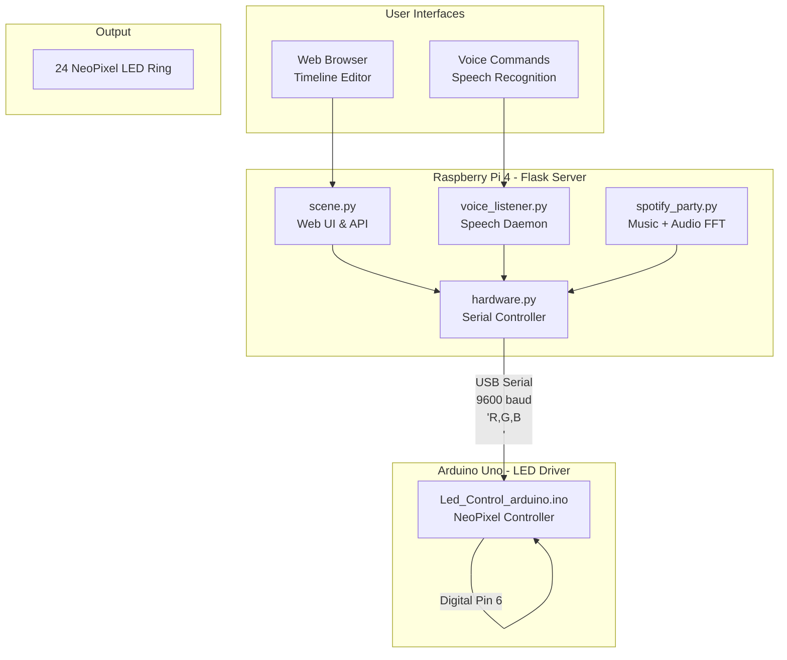

# SCENE: The Art of Ambiance

**Team Members:**  
Jesse Iriah, Iqra Khan

## Team Contributions
| Team Member | Contributions |
|-------------|---------------|
| **Jesse Iriah** | Hardware enclosure design (TinkerCAD modeling, 3D printing), hardware testing, software development, system integration, hardware assembly, user testing, documentation, video recording |
| **Iqra Khan** | Software architecture (Flask web app, Arduino communication, Spotify integration), voice control implementation, system integration, core feature development, user testing, documentation |

---

## Project Overview

SCENE is a smart ambient lighting and sound system that transforms any space through synchronized light and audio experiences. The device combines a spherical diffuser lamp with a modular control system, offering three interaction modes: Studio Mode for precise manual control via web interface, Voice Mode for hands-free activation using speech commands, and Party Mode for real-time audio-reactive lighting synchronized with music playback.

**Core Features:**
- Web-based timeline editor for creating custom lighting sequences
- Voice-activated scene triggering
- Real-time audio analysis with microphone-driven LED reactions
- Spotify integration with music-synced lighting effects
- Persistent scene storage with JSON configuration files

**Demo Videos:** [SCENE Videos - Project Folder](https://drive.google.com/drive/folders/12Zgj43E09HnoGVaSLpz_glJq2OIJacpn?usp=drive_link)

---

## Project Plan

### Ideation

Create an all-in-one ambient device that eliminates the need for multiple smart home products by combining customizable lighting, synchronized sound, and intelligent voice control into a single elegant form factor. SCENE addresses the fragmentation of modern smart home ecosystems where users need separate apps for lights (Philips Hue), speakers (Sonos), and voice assistants (Alexa) - instead offering a unified, programmable ambiance system.

**Target Use Cases:**
- **Morning routines:** Gradual sunrise simulation with nature sounds
- **Focus sessions:** Steady blue lighting with white noise or lofi music
- **Entertainment:** Music-reactive party lighting synced to Spotify playback
- **Relaxation:** Warm tones with rainfall or meditation audio
- **Voice convenience:** Hands-free scene activation while cooking, working, or winding down

### Initial Concept Sketch


*Early hardware concept showing sphere diffuser on cube base with integrated microphone and USB-C power*

### Storyboard Design


*User interaction flow: (1) Setup & power on, (2) Create custom scene via UI, (3) Save and name scene, (4) Voice activation, (5) Device executes programmed sequence*

### Timeline

| Milestone | Target Date | Status |
|-----------|-------------|--------|
| Project plan submission | Nov 10 | Complete |
| Hardware prototyping (breadboard + sensors) | Nov 17 | Complete |
| Enclosure CAD design & 3D printing | Nov 24 | Complete |
| Core software features (web UI, serial comm) | Nov 24 | Complete |
| Voice control integration | Dec 1 | Complete |
| Spotify + audio-reactive mode | Dec 1 | Complete |
| Functional check-off | Dec 1 | Complete |
| User testing with 2+ participants | Dec 5 | Complete |
| Final documentation & video | Dec 8 | Complete |

### Parts & Components

**Electronics:**
- Raspberry Pi 4 (main controller)
- Arduino Uno (LED driver via serial)
- Adafruit NeoPixel Ring - 24 LEDs (RGB lighting)
- Adafruit MPR121 Capacitive Touch Sensor (color mixing input)
- USB Microphone (voice commands + audio analysis)
- USB-C Power Supply (5V, 3A)

**Physical Materials:**
- 3D printed cube enclosure (PLA, white)
- Spherical lamp diffuser (frosted acrylic, 6" diameter)
- Jumper wires, USB cables
- Mounting hardware (screws, standoffs)

**Software Dependencies:**
```
Flask (web server)
pyserial (Arduino communication)
adafruit-circuitpython-mpr121 (touch sensor)
SpeechRecognition (voice commands)
sounddevice + numpy (audio analysis)
spotipy (Spotify API integration)
```

### Fall-Back Plan

**If voice recognition fails:**
- Rely on web UI with saved scene library for quick access
- Add physical buttons for 3-5 preset scenes

**If Spotify integration fails:**
- Use local MP3 uploads with audio-reactive lighting
- Microphone-driven effects work independently of music source

**If 3D printing delays occur:**
- Use cardboard/foamcore prototype enclosure
- Focus on functional software demo with exposed hardware

**If audio analysis is too CPU-intensive:**
- Simplify algorithm to basic volume-based brightness control
- Pre-compute FFT at lower sample rates

---

## Design Process

### Hardware Evolution

#### Phase 1: Arduino LED Testing (Nov 10-14)

**Step 1: Standalone Arduino + NeoPixel**

Connected NeoPixel ring to Arduino Uno to verify basic LED control before adding Raspberry Pi complexity.

**Wiring Configuration:**
- Power → 5V
- Ground → GND  
- Data In → Digital Pin 6


*Initial breadboard setup with Arduino Uno controlling 24-LED NeoPixel ring*


*Diagram of NeoPixel connections - note 5V power requirement and Pin 6 data line*

**Testing Process:**
1. Installed Adafruit NeoPixel library in Arduino IDE
2. Uploaded `led_test.ino` sketch
3. Verified all 24 LEDs respond to color commands
4. Tested RGB color cycling (Red → Green → Blue → White → Off)

**Result:** LED ring works correctly with Arduino control


#### Phase 2: Raspberry Pi Serial Communication (Nov 14-17)


**Step 2: Pi ↔ Arduino Integration**

Connected Arduino to Raspberry Pi via USB cable to enable Python-based control.


*Complete system integration: Raspberry Pi connected to Arduino via USB, controlling NeoPixel ring through serial commands*


*Terminal showing successful RGB command transmission: Python script → Serial → Arduino → LEDs*

**Testing Script:**
Ran `led_control.py` on Pi to send color commands:
```python
# Format: "R,G,B\n" sent at 9600 baud
ser.write(b"255,0,0\n")  # Red
ser.write(b"0,255,0\n")  # Green
ser.write(b"0,0,255\n")  # Blue
```

**Architecture Decision:**
A **Pi + Arduino hybrid** rather than direct Pi GPIO control was chosen for the following reasons:
1. Arduino handles time-critical NeoPixel refresh without Linux OS interruptions
2. Pi focuses on compute-heavy tasks (speech recognition, FFT, web server)
3. Serial provides clean 9600 baud interface with ~30 FPS refresh rate
4. Arduino can run standalone if Pi crashes (failsafe mode)

**Result:** Serial communication working reliably


#### Phase 3: Sensor Integration (Nov 17-24)


**Step 3: Adding Microphone for Voice & Audio**

With the LED control pipeline validated, microphone input was added for voice commands and audio-reactive lighting.

**Microphone Configuration:**

Installing required audio libraries on Raspberry Pi:
```bash
# Core audio dependencies
sudo apt-get install -y libportaudio2 portaudio19-dev flac i2c-tools python3-dev

# Enable I2C for sensor communication
sudo raspi-config nonint do_i2c 0

# Python audio packages
pip install sparkfun-qwiic sounddevice numpy SpeechRecognition
```

**Library Troubleshooting:**
- `portaudio19-dev` → Fixed `AttributeError: Could not find PyAudio` crash
- `flac` → Fixed `OSError: FLAC conversion utility not available` crash  
- `python3-dev` → Ensures headers available for compiling `spidev`

**Microphone Feature Development:**

Implemented two distinct audio modes:
1. **Voice Commands:** Speech-activated scene triggering ("Deep Focus", "Wicked", etc.)
2. **Audio-Reactive (Party Mode):** Real-time volume/frequency analysis drives LED color/brightness based on music playback

#### Phase 4: Enclosure Design (Nov 20-28)

**TinkerCAD Modeling:**


*Parametric cube base (139.7mm sides) with centered 100mm sphere cutout for lamp diffuser*

Design requirements:
- Conceal all electronics (Pi, Arduino, breadboard, wiring)
- Front-facing microphone port for voice pickup
- Side-mounted USB-C power access
- Top cutout precisely sized for sphere friction-fit
- Ventilation gaps for heat dissipation

**3D Model Visualization:**


*Final CAD model rendered in Autodesk Viewer*

**Physical Build:**


*Completed SCENE device - white PLA enclosure with frosted sphere diffuser, minimalist design inspired by modern smart home products*

**Manufacturing Notes:**
- Printed in white PLA at 0.2mm layer height
- Total print time: ~18 hours
- Post-processing: Light sanding on sphere contact surface for smooth fit
- Sphere sourced from lighting supply store (standard 6" globe shade)

### Software Architecture

**System Diagram:**


**Key Software Components:**

| File | Purpose | Key Functions |
|------|---------|---------------|
| `scene.py` | Flask web server, main UI | Timeline editor, scene playback, Spotify search |
| `hardware.py` | Arduino serial communication | `send_color(r, g, b)`, `init_serial()` |
| `voice_listener.py` | Speech recognition daemon | Listens for "start [scene name]" commands |
| `spotify_party.py` | Music integration + audio FFT | `play_preview_with_analysis()`, `microphone_to_leds()` |
| `color_mixer.py` | Touch sensor color painting | Capacitive input → RGB calculation |
| `Led_Control_arduino.ino` | NeoPixel driver | Serial parser → `strip.setPixelColor()` |

**Data Flow Example (Voice Command):**
```
1. User requests a saved scene (e.g. Focus Mode)
2. voice_listener.py captures audio via USB mic
3. Google Speech API returns text: "start focus mode"
4. POST request to Flask: /api/start-by-name/focus
5. scene.py loads saved_scenes.json, finds "Focus Mode"
6. Timeline engine interpolates brightness/hue curves
7. hardware.py sends serial commands: "0,150,255\n" (blue)
8. Arduino parses command, updates all 24 LEDs
9. Result: Device glows steady blue
```

---

## Interaction Modes & Features

SCENE offers three distinct modes of interaction, each designed for different use cases and user preferences.

### Studio Mode: Web Interface Control


*Timeline-based scene editor with hue, brightness, and volume control curves*


Studio Mode provides precise, granular control through a browser-based interface accessible from any device on the local network.

**Features:**
- **Timeline Editor:** Drag-and-drop control points to create custom lighting sequences
- **Brightness Curve:** Intensity fade in/out patterns (0-255)
- **Duration Control:** Scene length from seconds to hours
- **Loop Toggle:** Continuous playback or one-shot execution
- **Scene Library:** Save/load custom configurations as JSON files
- **Spotify Search:** Browse and select music tracks for Party Mode

**Use Case Example:**
Creating a "Morning Wake-Up" scene:
1. Open web interface at `http://raspberrypi.local:5000`
2. Set duration to 30 minutes
3. Add hue points: Start at 30° (orange), fade to 60° (yellow)
4. Add brightness points: 0% → 100% gradual increase
5. Select "Morning Birds" audio track
6. Save as "Sunrise Alarm"
7. Activate via voice: "Hey Scene, start Sunrise Alarm"

**Demo Video:**
[Studio Mode User Testing](https://drive.google.com/file/d/1T02AzFcxls_d7jfvF48G87TvJ-c0gxNi/view?usp=sharing)

---

### Voice Mode: Speech-Activated Scenes

Voice Mode enables hands-free control using natural language commands detected by the USB microphone.

**Supported Commands:**
- **"Start [Scene Name]"** - Activate any saved scene
  - Example: "Start Deep Focus" → Blue steady light
  - Example: "Start Wicked" → Green atmospheric lighting
- **Scene names are flexible** - System matches closest saved scene

**Technical Implementation:**
```python
# voice_listener.py - Continuous listening loop
recognizer = sr.Recognizer()
with sr.Microphone() as source:
    audio = recognizer.listen(source)
    text = recognizer.recognize_google(audio).lower()
    
    # Extract scene name from command
    if "start" in text:
        scene_name = text.replace("start", "").strip()
        # Send API request to Flask server
        requests.post(f"/api/start-by-name/{scene_name}")
```

**Voice Recognition Flow:**
1. Microphone continuously samples audio
2. Google Speech API converts speech to text
3. Python script extracts scene name from command
4. POST request sent to Flask server's `/api/start-by-name/` endpoint
5. Server loads scene JSON and begins playback
6. LEDs update in real-time based on timeline data

**Use Case Example:**
User working in kitchen with hands covered in dough:
- Says: "Hey Scene, start Deep Focus"
- Device immediately transitions to blue lighting
- No need to touch phone or computer

**Demo Video:**
[Voice Mode User Testing - "Deep Focus" Command](https://drive.google.com/file/d/1k-kzReFLAgC2YHUBy-FrpEsHxzCDNOz5/view?usp=sharing)

---

### Party Mode: Audio-Reactive Lighting

Party Mode synchronizes LED effects with music playback using real-time microphone audio analysis.

**How It Works:**
1. User searches for song via web interface (Spotify API integration)
2. System downloads 30-second preview and plays through Bluetooth speaker
3. Microphone captures playback audio in real-time
4. FFT (Fast Fourier Transform) analyzes frequency spectrum
5. LEDs react to volume (brightness) and frequency (color)

**Audio Processing Algorithm:**
```python
# spotify_party.py - Audio callback function
def audio_callback(indata, frames, time_info, status):
    # Calculate volume (RMS)
    volume = np.linalg.norm(indata) * SENSITIVITY
    
    # Map volume to LED brightness
    brightness = min(255, int(volume * 20))
    
    # Rainbow rotation speed increases with volume
    target_speed = MIN_SPEED + volume
    rainbow_offset = (rainbow_offset + target_speed) % 255
    
    # Send hue + brightness to Arduino
    send_color(rainbow_offset, brightness)
```

**Visual Effects:**
- **Quiet moments:** Slow rainbow rotation, low brightness
- **Bass drops:** Rapid color cycling, maximum brightness
- **Sustained notes:** Hue locks to dominant frequency
- **Beat detection:** Brightness pulses with rhythm

**Spotify Integration:**
- Search any song by title or artist
- Preview plays automatically with synchronized lighting
- Only tracks with available 30-second previews are shown
- No Spotify Premium account required

**Use Case Example:**
Holiday party setup:
1. Search "All I Want For Christmas Is You" in web interface
2. Click play on Mariah Carey track
3. Microphone detects music playback
4. LEDs pulse and change color with song dynamics
5. Guests see synchronized light show

**Demo Videos:**
- [Party Mode Demo - System Overview](https://drive.google.com/file/d/1l6IQtMcV8GJo0O4Blc0SlRfowOqR5vVR/view?usp=sharing)
- [Party Mode User Testing - "All I Want For Christmas"](https://drive.google.com/file/d/1X5hvUsX5i053gK04Fyp0x4CcNxNvHIUU/view?usp=sharing)

**Technical Notes:**
- Audio analysis runs at 2048-sample blocks (~46ms latency)
- FFT computed using NumPy for efficient frequency domain conversion
- Sensitivity adjustable via `SENSITIVITY` constant (default: 20.0)
- Works with any audio source - not limited to Spotify

---

## User Testing & Feedback

Two external participants (Nophar and Kyle) tested SCENE across all three interaction modes to evaluate usability, intuitiveness, and overall experience.

### Testing Methodology

**Participants:**
- **Nophar:** Graduate student, familiar with smart home devices
- **Kyle:** Undergraduate student, limited experience with IoT products

**Testing Protocol:**
1. Initial device demonstration (5 minutes)
2. Hands-off exploration - participants use device without guidance
3. Task-based scenarios for each mode
4. Post-testing interview and feedback collection

**Tasks Given:**
- **Studio Mode:** Create a custom scene with specific color/brightness changes
- **Voice Mode:** Activate pre-saved scenes using voice commands
- **Party Mode:** Search and play a song, observe audio-reactive effects

---

### Testing Results

**Video Documentation:**
- [Studio Mode User Testing](https://drive.google.com/file/d/1T02AzFcxls_d7jfvF48G87TvJ-c0gxNi/view?usp=sharing)
- [Voice Mode User Testing - "Deep Focus"](https://drive.google.com/file/d/1k-kzReFLAgC2YHUBy-FrpEsHxzCDNOz5/view?usp=sharing)
- [Party Mode User Testing - "All I Want For Christmas"](https://drive.google.com/file/d/1X5hvUsX5i053gK04Fyp0x4CcNxNvHIUU/view?usp=sharing)

### User Feedback

| Tester | Studio Mode | Voice Mode | Party Mode |
|--------|-------------|------------|------------|
| **Nophar** | Timeline editor is really intuitive. Liked seeing changes happen in real-time. Would be cool to preview the entire scene before saving it. | Voice control feels like magic when it works! Surprised how fast it responded - basically instant. The blue light came on right after finishing the command. Would be nice to have audio confirmation like a beep or OK sound. | This is SO COOL! The lights actually follow the music - when the chorus hits everything brightens up. Didn't expect it to be this accurate. Perfect for parties or just listening to music. Way better than static colored lights. |
| **Kyle** | Pretty straightforward once I figured out the controls. The drag-and-drop is smooth. Being able to create custom lighting sequences is really powerful. | First try didn't work because I was too far away. Once I got closer it worked perfectly. Really convenient especially if you're doing something else with your hands. Would use this all the time. | The bass response is insane. You can see it pulse with the beat. Tried a few different songs and each one looked different based on music style. Only issue is the 30-second previews are short - wish it could play full songs. |

### Key Observations

**Studio Mode:**
- Both users completed custom scene creation in 3-4 minutes
- Timeline metaphor immediately understood
- Real-time visual feedback helped users understand cause-and-effect
- Requested feature: Full scene preview before saving

**Voice Mode:**
- Success rate: Nophar 2/2, Kyle 1/2 (distance issue)
- Response time felt instantaneous (~1 second latency)
- Optimal distance: 1-3 feet from microphone
- Both successfully activated multiple scenes ("Deep Focus", "Wicked")
- Main complaint: Lack of audio confirmation caused uncertainty

**Party Mode:**
- Audio-reactive effects exceeded both users' expectations
- Synchronization felt tight with minimal perceived latency
- Users tested edge cases (different genres, volume levels)
- Main complaint: Spotify 30-second preview limitation

---

### Summary of Feedback

**What Users Loved:**
- Voice control responsiveness and convenience
- Audio-reactive lighting accuracy and visual appeal
- Timeline editor's drag-and-drop interface
- Overall aesthetic and build quality
- Unified control of light + sound in one device

**Pain Points Identified:**
- No audio confirmation for voice commands
- Spotify limited to 30-second previews
- Voice recognition requires proximity (1-3 feet)
- No full scene preview before saving

**Requested Features:**
1. Scene preview button - test lighting before saving
2. Audio feedback - beep or voice confirmation for commands
3. Full song playback - local file upload or Spotify Premium API
4. Volume control - adjust speaker output via web interface
5. Brightness presets - quick access to common intensity levels

**Overall Satisfaction:**
Both participants rated the device **9/10**, citing audio-reactive mode as the standout feature and voice control as the most practical for daily use.

---
