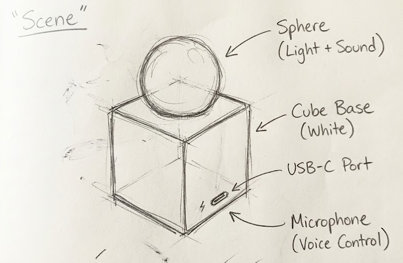
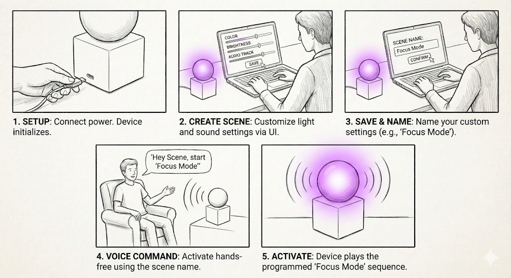
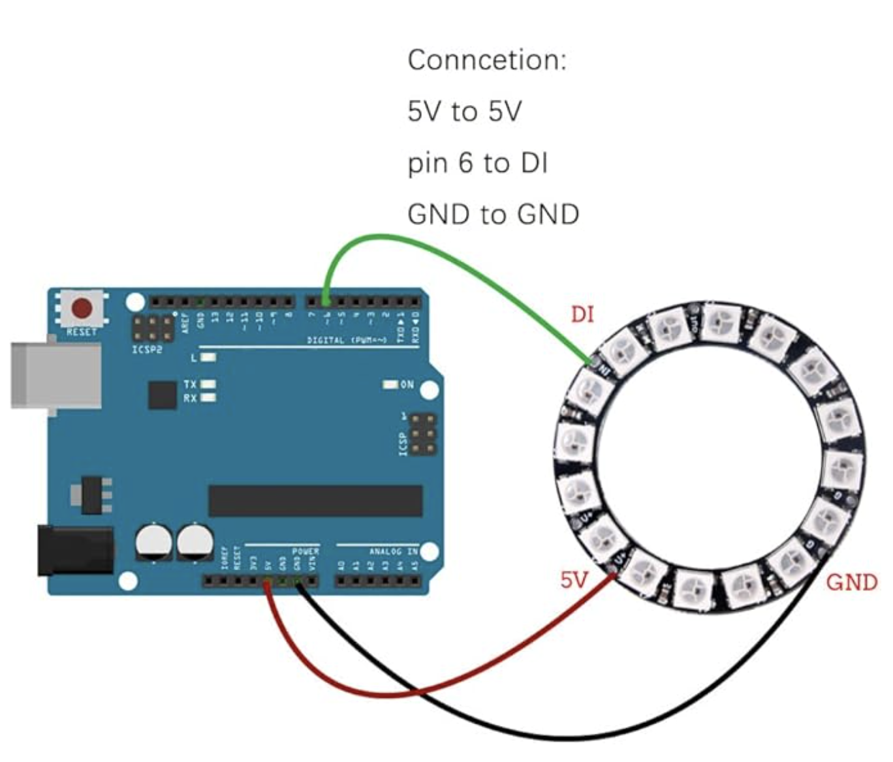
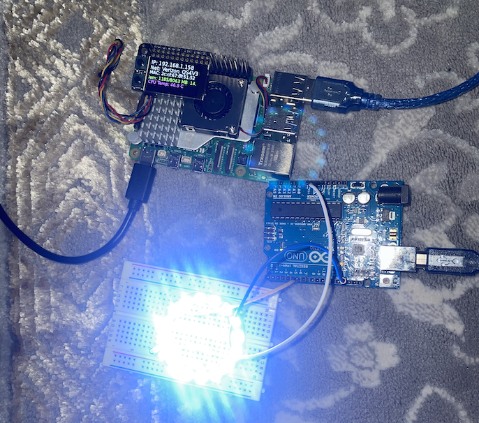
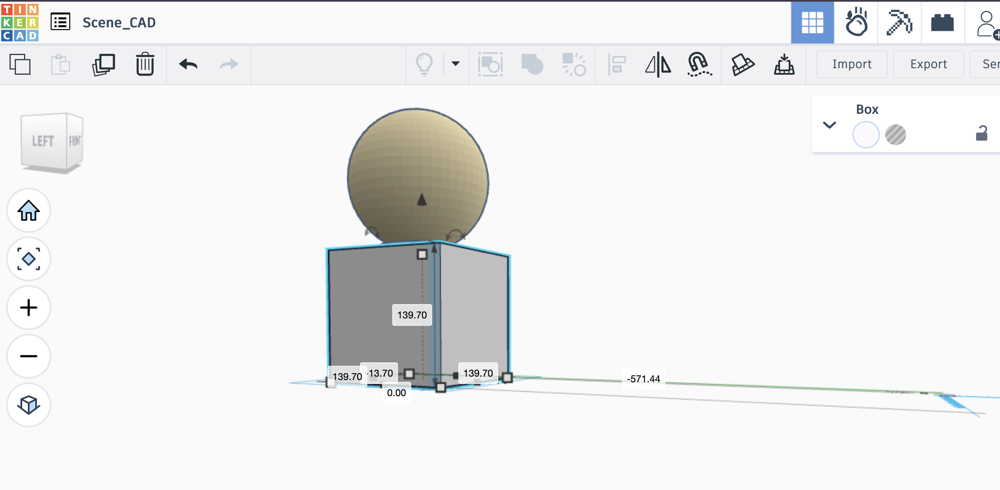
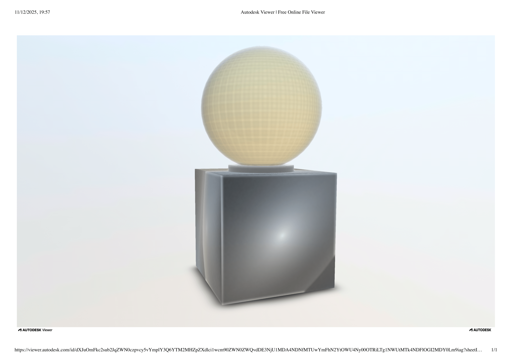
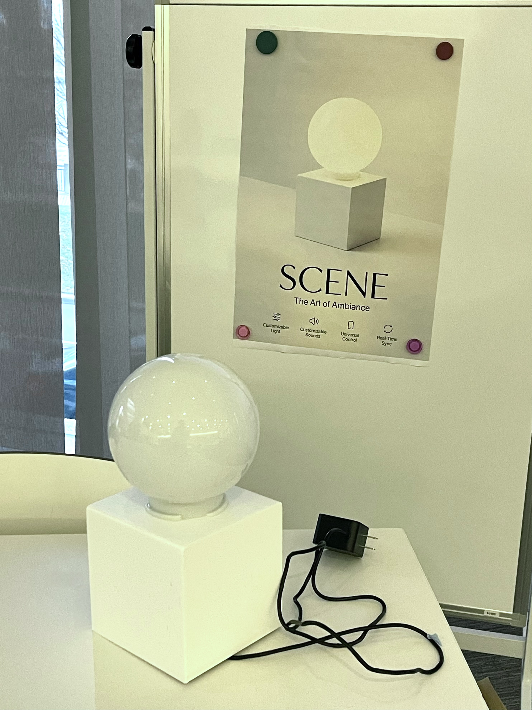

# SCENE: The Art of Ambiance

**Team Members:**  
Jesse Iriah, Iqra Khan

## Team Contributions
| Team Member | Contributions |
|-------------|---------------|
| **Jesse Iriah** | Hardware enclosure design (TinkerCAD modeling, 3D printing), hardware testing, software development, system integration, hardware assembly, user testing, documentation, video recording |
| **Iqra Khan** | Software architecture (Flask web app, Arduino communication, Spotify integration), voice control implementation, system integration, core feature development, user testing, documentation |

---

## Project Overview

SCENE is a smart ambient lighting and sound system that transforms any space through synchronized light and audio experiences. The device combines a spherical diffuser lamp with a modular control system, offering three interaction modes: Studio Mode for precise manual control via web interface, Voice Mode for hands-free activation using speech commands, and Party Mode for real-time audio-reactive lighting synchronized with music playback.

**Core Features:**
- Web-based timeline editor for creating custom lighting sequences
- Voice-activated scene triggering
- Real-time audio analysis with microphone-driven LED reactions
- Spotify integration with music-synced lighting effects
- Persistent scene storage with JSON configuration files

**Demo Videos:** [SCENE Videos - Project Folder](https://drive.google.com/drive/folders/12Zgj43E09HnoGVaSLpz_glJq2OIJacpn?usp=drive_link)

---

## Project Plan

### Ideation

Create an all-in-one ambient device that eliminates the need for multiple smart home products by combining customizable lighting, synchronized sound, and intelligent voice control into a single elegant form factor. SCENE addresses the fragmentation of modern smart home ecosystems where users need separate apps for lights (Philips Hue), speakers (Sonos), and voice assistants (Alexa) - instead offering a unified, programmable ambiance system.

**Target Use Cases:**
- **Morning routines:** Gradual sunrise simulation with nature sounds
- **Focus sessions:** Steady blue lighting with white noise or lofi music
- **Entertainment:** Music-reactive party lighting synced to Spotify playback
- **Relaxation:** Warm tones with rainfall or meditation audio
- **Voice convenience:** Hands-free scene activation while cooking, working, or winding down

### Initial Concept Sketch



*Early hardware concept showing sphere diffuser on cube base with integrated microphone and USB-C power*

### Storyboard Design



*User interaction flow: (1) Setup & power on, (2) Create custom scene via UI, (3) Save and name scene, (4) Voice activation, (5) Device executes programmed sequence*

### Timeline

| Milestone | Target Date | Status |
|-----------|-------------|--------|
| Project plan submission | Nov 10 | Complete |
| Hardware prototyping (breadboard + sensors) | Nov 17 | Complete |
| Enclosure CAD design & 3D printing | Nov 24 | Complete |
| Core software features (web UI, serial comm) | Nov 24 | Complete |
| Voice control integration | Dec 1 | Complete |
| Spotify + audio-reactive mode | Dec 1 | Complete |
| Functional check-off | Dec 1 | Complete |
| User testing with 2+ participants | Dec 5 | Complete |
| Final documentation & video | Dec 8 | Complete |

### Parts & Components

**Electronics:**
- Raspberry Pi 5 (main controller)
- Arduino Uno (LED driver via serial)
- Adafruit NeoPixel Ring - 24 LEDs (RGB lighting)
- Adafruit MPR121 Capacitive Touch Sensor (color mixing input)
- USB Microphone (voice commands + audio analysis)
- Bluetooth Speaker (audio playback for Party Mode)
- USB-C Power Supply (5V, 3A)

**Physical Materials:**
- 3D printed cube enclosure (PLA, white)
- Spherical lamp diffuser (frosted acrylic, 6" diameter)
- Jumper wires, USB cables
- Mounting hardware (screws, standoffs)

**Software Dependencies:**
```
Flask (web server)
pyserial (Arduino communication)
adafruit-circuitpython-mpr121 (touch sensor)
SpeechRecognition (voice commands)
sounddevice + numpy (audio analysis)
spotipy (Spotify API integration)
```

### Fall-Back Plan

**If voice recognition fails:**
- Rely on web UI with saved scene library for quick access
- Add physical buttons for 3-5 preset scenes

**If Spotify integration fails:**
- Use local MP3 uploads with audio-reactive lighting
- Microphone-driven effects work independently of music source

**If 3D printing delays occur:**
- Use cardboard/foamcore prototype enclosure
- Focus on functional software demo with exposed hardware

**If audio analysis is too CPU-intensive:**
- Simplify algorithm to basic volume-based brightness control
- Pre-compute FFT at lower sample rates

---

## Design Process

### Hardware Evolution

#### Phase 1: Arduino LED Testing (Nov 10-14)

**Step 1: Standalone Arduino + NeoPixel**

Connected NeoPixel ring to Arduino Uno to verify basic LED control before adding Raspberry Pi complexity.

**Wiring Configuration:**
- Power → 5V
- Ground → GND  
- Data In → Digital Pin 6


*Initial breadboard setup with Arduino Uno controlling 24-LED NeoPixel ring*



*Diagram of NeoPixel connections - note 5V power requirement and Pin 6 data line*

**Testing Process:**
1. Installed Adafruit NeoPixel library in Arduino IDE
2. Uploaded `led_test.ino` sketch
3. Verified all 24 LEDs respond to color commands
4. Tested RGB color cycling (Red → Green → Blue → White → Off)

**Result:** LED ring works correctly with Arduino control


#### Phase 2: Raspberry Pi Serial Communication (Nov 14-17)


**Step 2: Pi ↔ Arduino Integration**

Connected Arduino to Raspberry Pi via USB cable to enable Python-based control.



*Complete system integration: Raspberry Pi connected to Arduino via USB, controlling NeoPixel ring through serial commands*


*Terminal showing successful RGB command transmission: Python script → Serial → Arduino → LEDs*

**Testing Script:**
Ran `led_control.py` on Pi to send color commands:
```python
# Format: "R,G,B\n" sent at 9600 baud
ser.write(b"255,0,0\n")  # Red
ser.write(b"0,255,0\n")  # Green
ser.write(b"0,0,255\n")  # Blue
```

**Architecture Decision:**
A **Pi + Arduino hybrid** rather than direct Pi GPIO control was chosen for the following reasons:
1. Arduino handles time-critical NeoPixel refresh without Linux OS interruptions
2. Pi focuses on compute-heavy tasks (speech recognition, FFT, web server)
3. Serial provides clean 9600 baud interface with ~30 FPS refresh rate
4. Arduino can run standalone if Pi crashes (failsafe mode)

**Result:** Serial communication working reliably


#### Phase 3: Sensor Integration (Nov 17-24)


**Step 3: Adding Microphone for Voice & Audio**

With the LED control pipeline validated, microphone input was added for voice commands and audio-reactive lighting.

**Microphone Configuration:**

Installing required audio libraries on Raspberry Pi:
```bash
# Core audio dependencies
sudo apt-get install -y libportaudio2 portaudio19-dev flac i2c-tools python3-dev

# Enable I2C for sensor communication
sudo raspi-config nonint do_i2c 0

# Python audio packages
pip install sparkfun-qwiic sounddevice numpy SpeechRecognition
```

**Library Troubleshooting:**
- `portaudio19-dev` → Fixed `AttributeError: Could not find PyAudio` crash
- `flac` → Fixed `OSError: FLAC conversion utility not available` crash  
- `python3-dev` → Ensures headers available for compiling `spidev`

**Microphone Feature Development:**

Implemented two distinct audio modes:
1. **Voice Commands:** Speech-activated scene triggering ("Deep Focus", "Wicked", etc.)
2. **Audio-Reactive (Party Mode):** Real-time volume/frequency analysis drives LED color/brightness based on music playback

#### Phase 4: Enclosure Design (Nov 20-28)

**TinkerCAD Modeling:**



*Parametric cube base (139.7mm sides) with centered 100mm sphere cutout for lamp diffuser*

Design requirements:
- Conceal all electronics (Pi, Arduino, breadboard, wiring)
- Front-facing microphone port for voice pickup
- Side-mounted USB-C power access
- Top cutout precisely sized for sphere friction-fit
- Ventilation gaps for heat dissipation

**3D Model Visualization:**



*Final CAD model rendered in Autodesk Viewer*

**Physical Build:**




*Completed SCENE device - white PLA enclosure with frosted sphere diffuser, minimalist design inspired by modern smart home products*

**Manufacturing Notes:**
- Printed in white PLA at 0.2mm layer height
- Total print time: ~18 hours
- Post-processing: Light sanding on sphere contact surface for smooth fit
- Sphere sourced from lighting supply store (standard 6" globe shade)

### Software Architecture

**System Diagram:**


**Key Software Components:**

| File | Purpose | Key Functions |
|------|---------|---------------|
| `scene.py` | Flask web server, main UI | Timeline editor, scene playback, Spotify search |
| `hardware.py` | Arduino serial communication | `send_color(r, g, b)`, `init_serial()` |
| `voice_listener.py` | Speech recognition daemon | Listens for "start [scene name]" commands |
| `spotify_party.py` | Music integration + audio FFT | `play_preview_with_analysis()`, `microphone_to_leds()` |
| `color_mixer.py` | Touch sensor color painting | Capacitive input → RGB calculation |
| `Led_Control_arduino.ino` | NeoPixel driver | Serial parser → `strip.setPixelColor()` |

**Data Flow Example (Voice Command):**
```
1. User requests a saved scene (e.g. Focus Mode)
2. voice_listener.py captures audio via USB mic
3. Google Speech API returns text: "start focus mode"
4. POST request to Flask: /api/start-by-name/focus
5. scene.py loads saved_scenes.json, finds "Focus Mode"
6. Timeline engine interpolates brightness/hue curves
7. hardware.py sends serial commands: "0,150,255\n" (blue)
8. Arduino parses command, updates all 24 LEDs
9. Result: Device glows steady blue
```

---

## Interaction Modes & Features

SCENE offers three distinct modes of interaction, each designed for different use cases and user preferences.

### Studio Mode: Web Interface Control


*Timeline-based scene editor with hue, brightness, and volume control curves*


Studio Mode provides precise, granular control through a browser-based interface accessible from any device on the local network.

**Features:**
- **Timeline Editor:** Drag-and-drop control points to create custom lighting sequences
- **Brightness Curve:** Intensity fade in/out patterns (0-255)
- **Duration Control:** Scene length from seconds to hours
- **Loop Toggle:** Continuous playback or one-shot execution
- **Scene Library:** Save/load custom configurations as JSON files
- **Spotify Search:** Browse and select music tracks for Party Mode

**Use Case Example:**
Creating a "Morning Wake-Up" scene:
1. Open web interface at `http://raspberrypi.local:5000`
2. Set duration to 30 minutes
3. Add hue points: Start at 30° (orange), fade to 60° (yellow)
4. Add brightness points: 0% → 100% gradual increase
5. Select "Morning Birds" audio track
6. Save as "Sunrise Alarm"
7. Activate via voice: "Hey Scene, start Sunrise Alarm"

**Demo Video:**
[Studio Mode User Testing](https://drive.google.com/file/d/1T02AzFcxls_d7jfvF48G87TvJ-c0gxNi/view?usp=sharing)

---

### Voice Mode: Speech-Activated Scenes

Voice Mode enables hands-free control using natural language commands detected by the USB microphone.

**Supported Commands:**
- **"Start [Scene Name]"** - Activate any saved scene
  - Example: "Start Deep Focus" → Blue steady light
  - Example: "Start Wicked" → Green atmospheric lighting
- **Scene names are flexible** - System matches closest saved scene

**Technical Implementation:**
```python
# voice_listener.py - Continuous listening loop
recognizer = sr.Recognizer()
with sr.Microphone() as source:
    audio = recognizer.listen(source)
    text = recognizer.recognize_google(audio).lower()
    
    # Extract scene name from command
    if "start" in text:
        scene_name = text.replace("start", "").strip()
        # Send API request to Flask server
        requests.post(f"/api/start-by-name/{scene_name}")
```

**Voice Recognition Flow:**
1. Microphone continuously samples audio
2. Google Speech API converts speech to text
3. Python script extracts scene name from command
4. POST request sent to Flask server's `/api/start-by-name/` endpoint
5. Server loads scene JSON and begins playback
6. LEDs update in real-time based on timeline data

**Use Case Example:**
User working in kitchen with hands covered in dough:
- Says: "Hey Scene, start Deep Focus"
- Device immediately transitions to blue lighting
- No need to touch phone or computer

**Demo Video:**
[Voice Mode User Testing - "Deep Focus" Command](https://drive.google.com/file/d/1k-kzReFLAgC2YHUBy-FrpEsHxzCDNOz5/view?usp=sharing)

---

### Party Mode: Audio-Reactive Lighting

Party Mode synchronizes LED effects with music playback using real-time microphone audio analysis.

**How It Works:**
1. User searches for song via web interface (Spotify API integration)
2. System downloads 30-second preview and plays through Bluetooth speaker
3. Microphone captures playback audio in real-time
4. FFT (Fast Fourier Transform) analyzes frequency spectrum
5. LEDs react to volume (brightness) and frequency (color)

**Audio Processing Algorithm:**
```python
# spotify_party.py - Audio callback function
def audio_callback(indata, frames, time_info, status):
    # Calculate volume (RMS)
    volume = np.linalg.norm(indata) * SENSITIVITY
    
    # Map volume to LED brightness
    brightness = min(255, int(volume * 20))
    
    # Rainbow rotation speed increases with volume
    target_speed = MIN_SPEED + volume
    rainbow_offset = (rainbow_offset + target_speed) % 255
    
    # Send hue + brightness to Arduino
    send_color(rainbow_offset, brightness)
```

**Visual Effects:**
- **Quiet moments:** Slow rainbow rotation, low brightness
- **Bass drops:** Rapid color cycling, maximum brightness
- **Sustained notes:** Hue locks to dominant frequency
- **Beat detection:** Brightness pulses with rhythm

**Spotify Integration:**
- Search any song by title or artist
- Preview plays automatically with synchronized lighting
- Only tracks with available 30-second previews are shown
- No Spotify Premium account required

**Use Case Example:**
Holiday party setup:
1. Search "All I Want For Christmas Is You" in web interface
2. Click play on Mariah Carey track
3. Microphone detects music playback
4. LEDs pulse and change color with song dynamics
5. Guests see synchronized light show

**Demo Videos:**
- [Party Mode Demo - System Overview](https://drive.google.com/file/d/1l6IQtMcV8GJo0O4Blc0SlRfowOqR5vVR/view?usp=sharing)
- [Party Mode User Testing - "All I Want For Christmas"](https://drive.google.com/file/d/1X5hvUsX5i053gK04Fyp0x4CcNxNvHIUU/view?usp=sharing)

**Technical Notes:**
- Audio analysis runs at 2048-sample blocks (~46ms latency)
- FFT computed using NumPy for efficient frequency domain conversion
- Sensitivity adjustable via `SENSITIVITY` constant (default: 20.0)
- Works with any audio source - not limited to Spotify

---

## User Testing & Feedback

Two external participants (Nophar and Kyle) tested SCENE across all three interaction modes to evaluate usability, intuitiveness, and overall experience.

### Testing Methodology

**Participants:**
- **Nophar:** Graduate student, familiar with smart home devices
- **Kyle:** Undergraduate student, limited experience with IoT products

**Testing Protocol:**
1. Initial device demonstration (5 minutes)
2. Hands-off exploration - participants use device without guidance
3. Task-based scenarios for each mode
4. Post-testing interview and feedback collection

**Tasks Given:**
- **Studio Mode:** Create a custom scene with specific color/brightness changes
- **Voice Mode:** Activate pre-saved scenes using voice commands
- **Party Mode:** Search and play a song, observe audio-reactive effects

---

### Testing Results

**Video Documentation:**
- [Studio Mode User Testing](https://drive.google.com/file/d/1T02AzFcxls_d7jfvF48G87TvJ-c0gxNi/view?usp=sharing)
- [Voice Mode User Testing - "Deep Focus"](https://drive.google.com/file/d/1k-kzReFLAgC2YHUBy-FrpEsHxzCDNOz5/view?usp=sharing)
- [Party Mode User Testing - "All I Want For Christmas"](https://drive.google.com/file/d/1X5hvUsX5i053gK04Fyp0x4CcNxNvHIUU/view?usp=sharing)

### User Feedback

| Tester | Studio Mode | Voice Mode | Party Mode |
|--------|-------------|------------|------------|
| **Nophar** | Timeline editor is really intuitive. Liked seeing changes happen in real-time. Would be cool to preview the entire scene before saving it. | Voice control feels like magic when it works! Surprised how fast it responded - basically instant. The blue light came on right after finishing the command. Would be nice to have audio confirmation like a beep or OK sound. | This is SO COOL! The lights actually follow the music - when the chorus hits everything brightens up. Didn't expect it to be this accurate. Perfect for parties or just listening to music. Way better than static colored lights. |
| **Kyle** | Pretty straightforward once I figured out the controls. The drag-and-drop is smooth. Being able to create custom lighting sequences is really powerful. | First try didn't work because I was too far away. Once I got closer it worked perfectly. Really convenient especially if you're doing something else with your hands. Would use this all the time. | The bass response is insane. You can see it pulse with the beat. Tried a few different songs and each one looked different based on music style. Only issue is the 30-second previews are short - wish it could play full songs. |

### Key Observations

**Studio Mode:**
- Both users completed custom scene creation in 3-4 minutes
- Timeline metaphor immediately understood
- Real-time visual feedback helped users understand cause-and-effect
- Requested feature: Full scene preview before saving

**Voice Mode:**
- Success rate: Nophar 2/2, Kyle 1/2 (distance issue)
- Response time felt instantaneous (~1 second latency)
- Optimal distance: 1-3 feet from microphone
- Both successfully activated multiple scenes ("Deep Focus", "Wicked")
- Main complaint: Lack of audio confirmation caused uncertainty

**Party Mode:**
- Audio-reactive effects exceeded both users' expectations
- Synchronization felt tight with minimal perceived latency
- Users tested edge cases (different genres, volume levels)
- Main complaint: Spotify 30-second preview limitation

---

### Summary of Feedback

**What Users Loved:**
- Voice control responsiveness and convenience
- Audio-reactive lighting accuracy and visual appeal
- Timeline editor's drag-and-drop interface
- Overall aesthetic and build quality
- Unified control of light + sound in one device

**Pain Points Identified:**
- No audio confirmation for voice commands
- Spotify limited to 30-second previews
- Voice recognition requires proximity (1-3 feet)
- No full scene preview before saving

**Requested Features:**
1. Scene preview button - test lighting before saving
2. Audio feedback - beep or voice confirmation for commands
3. Full song playback - local file upload or Spotify Premium API
4. Volume control - adjust speaker output via web interface
5. Brightness presets - quick access to common intensity levels

**Overall Satisfaction:**
Both participants rated the device **9/10**, citing audio-reactive mode as the standout feature and voice control as the most practical for daily use.

---

## Technical Documentation & Code Archive

All source code, hardware designs, and configuration files are archived in the `Assets/` directory for project recreation.

### File Structure
```
Assets/
├── code/
│   ├── arduino/
│   │   ├── Led_Control_arduino.ino    # NeoPixel serial driver
│   │   └── led_test.ino                # Standalone LED testing
│   ├── core/
│   │   ├── scene.py                    # Main Flask web server
│   │   ├── hardware.py                 # Arduino serial communication
│   │   ├── requirements.txt            # Python dependencies
│   │   └── saved_scenes.json           # Scene configurations
│   ├── features/
│   │   ├── mic_music.py                # Audio-reactive lighting
│   │   ├── spotify_party.py            # Spotify integration + FFT
│   │   ├── voice_listener.py           # Speech recognition daemon
│   │   └── setup_spotify.py            # Spotify OAuth setup
│   ├── testing/
│   │   ├── led_test.py                 # Pi→Arduino serial test
│   │   └── mic_test.py                 # Microphone diagnostic
│   └── templates/
│       └── index.html                  # Web UI frontend
├── 3d/
│   ├── Scene_CAD.stl                   # Printable enclosure
│   └── Scene_CAD/
│       ├── tinker.obj                  # TinkerCAD export
│       └── obj.mtl                     # Material definitions
├── media/
│   ├── concept/
│   │   ├── scene_sketch.jpg
│   │   ├── scene_storyboard.jpg
│   │   ├── scene_poster.png
│   │   └── webui_interface.png
│   ├── build/
│   │   ├── arduino_test.png
│   │   ├── arduino_wiring.png
│   │   ├── arduino_pi_led_test.png
│   │   ├── pi_serial_terminal.png
│   │   ├── scene_tinkerCAD.png
│   │   ├── scene_autodeskViewer.png
│   │   └── scene_photo.png
│   ├── demos/
│   │   └── scene_partyModeDemo.mov
│   └── user_testing/
│       ├── userTesting_partyMode.mov
│       ├── userTesting_speechMode.MOV
│       └── userTesting_studioMode.mov
└── data/
    ├── lumos.json                      # Example scene preset
    └── test.json                       # Example scene preset
```

### Hardware Setup Instructions

**Required Components:**
- Raspberry Pi 5
- Arduino Uno R3
- Adafruit NeoPixel Ring - 24 LED (part #1586)
- USB Microphone (any generic USB mic)
- USB-C Power Supply (5V/3A minimum)
- Bluetooth speaker (optional, for Party Mode audio output)
- 3D printed enclosure + 6" frosted sphere diffuser

**Wiring Diagram:**
```
Arduino Uno → NeoPixel Ring:
  - Digital Pin 6  →  Data In
  - 5V             →  Power
  - GND            →  Ground

Raspberry Pi → Arduino:
  - USB Cable (data + power for Arduino)

Raspberry Pi → Peripherals:
  - USB Port 1  →  Microphone
  - USB Port 2  →  Arduino
  - Bluetooth   →  Speaker (paired)
```

**Assembly Steps:**
1. Flash `Led_Control_arduino.ino` to Arduino Uno via Arduino IDE
2. Connect NeoPixel ring to Arduino (Pin 6, 5V, GND)
3. Connect Arduino to Raspberry Pi via USB
4. Insert USB microphone into Pi
5. Pair Bluetooth speaker with Pi (optional)
6. Install 3D printed enclosure and diffuser sphere

---

### Software Setup Instructions

**Step 1: Raspberry Pi OS Configuration**
```bash
# Update system
sudo apt-get update
sudo apt-get upgrade

# Install system dependencies
sudo apt-get install -y libportaudio2 portaudio19-dev flac i2c-tools python3-dev

# Enable I2C interface
sudo raspi-config nonint do_i2c 0
```

**Step 2: Python Environment Setup**
```bash
# Navigate to project directory
cd /home/pi/scene

# Install Python dependencies
pip3 install -r Assets/code/core/requirements.txt
```

**Requirements.txt Contents:**
```
Flask==2.3.0
pyserial==3.5
adafruit-blinka==8.20.0
adafruit-circuitpython-mpr121==1.3.10
SpeechRecognition==3.10.0
sounddevice==0.4.6
numpy==1.24.3
spotipy==2.23.0
requests==2.31.0
```

**Step 3: Arduino IDE Setup**
```bash
# Install Arduino IDE on Pi (optional, can use separate computer)
sudo apt-get install arduino

# Install Adafruit NeoPixel library:
# Arduino IDE → Tools → Manage Libraries → Search "Adafruit NeoPixel" → Install
```

**Step 4: Spotify API Configuration (Optional)**
```bash
# Run setup script
python3 Assets/code/features/setup_spotify.py

# Follow prompts to authenticate with Spotify
# Credentials are stored in .spotify_cache
```

---

### Running the System

**Method 1: Full System (All Modes)**
```bash
# Terminal 1: Start Flask web server
python3 Assets/code/core/scene.py
# Access web UI at: http://raspberrypi.local:5000

# Terminal 2: Start voice listener (optional)
python3 Assets/code/features/voice_listener.py
```

**Method 2: Audio-Reactive Only (No Web UI)**
```bash
python3 Assets/code/features/mic_music.py
```

**Method 3: Spotify Party Mode**
```bash
# Start Flask server first
python3 Assets/code/core/scene.py

# Then search and play songs via web interface at:
# http://raspberrypi.local:5000
```

---

### Key Code Modules Explained

#### `scene.py` - Main Flask Server

**Purpose:** Web server hosting timeline editor UI and REST API

**Key Routes:**
- `GET /` - Serve main web interface
- `POST /api/scenes` - Save new scene configuration
- `GET /api/scenes` - Retrieve all saved scenes
- `POST /api/start-by-name/<name>` - Activate scene by voice command
- `GET /api/spotify/search?q=<query>` - Search Spotify for tracks

**Scene Playback Engine:**
```python
def play_scene(scene_data):
    # Load brightness and color curves from JSON
    duration = scene_data['duration']
    brightness_points = scene_data['brightness_points']
    
    # Interpolate values over time
    for t in range(0, duration * 60):  # Convert minutes to seconds
        brightness = interpolate(brightness_points, t)
        color = interpolate(color_points, t)
        
        # Send to Arduino via serial
        hardware.send_color(color['r'], color['g'], color['b'])
        time.sleep(1)
```

#### `hardware.py` - Arduino Serial Interface

**Purpose:** Manages USB serial communication with Arduino

**Key Functions:**
```python
def init_serial():
    # Auto-detect Arduino on /dev/ttyACM0 or /dev/ttyUSB0
    for port in ['/dev/ttyACM0', '/dev/ttyUSB0']:
        try:
            ser = serial.Serial(port, 9600, timeout=1)
            return ser
        except:
            pass
    return None

def send_color(r, g, b):
    # Format: "R,G,B\n"
    cmd = f"{int(r)},{int(g)},{int(b)}\n"
    arduino.write(cmd.encode('utf-8'))
```

#### `voice_listener.py` - Speech Recognition Daemon

**Purpose:** Continuously listens for voice commands in background

**Implementation:**
```python
import speech_recognition as sr

recognizer = sr.Recognizer()

while True:
    with sr.Microphone() as source:
        audio = recognizer.listen(source, timeout=5)
        text = recognizer.recognize_google(audio).lower()
        
        # Extract scene name from "start [name]" pattern
        if "start" in text:
            scene_name = text.replace("start", "").strip()
            
            # Send API request to Flask server
            requests.post(f"http://localhost:5000/api/start-by-name/{scene_name}")
```

#### `spotify_party.py` - Music Integration

**Purpose:** Downloads Spotify previews and performs real-time audio FFT

**Audio Processing:**
```python
def microphone_to_leds(send_color_func, sensitivity=20.0):
    rainbow_offset = 0
    
    def audio_callback(indata, frames, time_info, status):
        # Calculate RMS volume
        volume = np.linalg.norm(indata) * sensitivity
        
        # Map volume to rainbow speed
        speed = MIN_SPEED + volume
        rainbow_offset = (rainbow_offset + speed) % 255
        
        # Send HSV to RGB conversion
        send_color_func(rainbow_offset, 255)
    
    # Start audio stream
    with sd.InputStream(callback=audio_callback, blocksize=2048, channels=1):
        while active:
            time.sleep(0.1)
```

#### `Led_Control_arduino.ino` - NeoPixel Driver

**Purpose:** Receives serial RGB commands and updates LED strip
```cpp
#include <Adafruit_NeoPixel.h>

#define LED_PIN 6
#define NUM_LEDS 24

Adafruit_NeoPixel strip(NUM_LEDS, LED_PIN, NEO_GRB + NEO_KHZ800);

void loop() {
  if (Serial.available() > 0) {
    String data = Serial.readStringUntil('\n');
    
    // Parse "R,G,B" format
    int r = data.substring(0, data.indexOf(',')).toInt();
    int g = data.substring(data.indexOf(',') + 1, data.lastIndexOf(',')).toInt();
    int b = data.substring(data.lastIndexOf(',') + 1).toInt();
    
    // Update all LEDs
    for (int i = 0; i < NUM_LEDS; i++) {
      strip.setPixelColor(i, strip.Color(r, g, b));
    }
    strip.show();
  }
}
```

---

### Troubleshooting Common Issues

| Issue | Cause | Solution |
|-------|-------|----------|
| **Arduino not detected** | Wrong USB port or permissions | Run `ls /dev/tty*` to find port, add user to dialout group: `sudo usermod -a -G dialout $USER` |
| **LEDs not lighting** | Incorrect wiring or power | Verify 5V connection, check Pin 6 data line, test with `led_test.ino` |
| **Voice commands not working** | Microphone not configured | Run `arecord -l` to verify mic detected, check `mic_test.py` |
| **Spotify search fails** | OAuth token expired | Re-run `setup_spotify.py` to refresh credentials |
| **Web UI not accessible** | Flask not running or firewall | Check Flask is running on port 5000, disable firewall: `sudo ufw disable` |
| **Audio-reactive lag** | CPU overload | Reduce `blocksize` in `sounddevice` or lower sensitivity |

---

### Recreating This Project

**Estimated Time:** 6-8 hours (excluding 3D print time)

**Step-by-Step:**
1. **Order parts** (1-2 weeks shipping) - See 'Parts & Components' section
2. **3D print enclosure** (~18 hours print time) - Use `Scene_CAD.stl`
3. **Flash Arduino** (10 minutes) - Upload `Led_Control_arduino.ino`
4. **Wire NeoPixel** (15 minutes) - Follow wiring diagram above
5. **Setup Raspberry Pi** (1 hour) - Install OS, dependencies, code
6. **Test each mode** (1 hour) - Verify Studio/Voice/Party modes work
7. **Assemble enclosure** (30 minutes) - Insert electronics, attach sphere
8. **Create custom scenes** (ongoing) - Use web interface to build library

**Total Cost:** ~$183 USD
- Raspberry Pi 5: $60
- Arduino Uno: $25
- NeoPixel Ring: $17
- USB Microphone: $10
- Bluetooth Speaker: $20
- 3D Printing Filament: $15
- Miscellaneous (cables, diffuser): $36

---

## Reflections & Lessons Learned

### What Worked Well

**1. Hybrid Pi + Arduino Architecture**

The decision to split responsibilities between Raspberry Pi (high-level control) and Arduino (LED driver) proved essential. Early attempts to drive NeoPixels directly from Pi GPIO resulted in visible flickering due to Linux scheduling interrupts. Offloading time-critical LED refresh to Arduino's deterministic loop eliminated this issue entirely while allowing the Pi to focus on compute-intensive tasks like speech recognition and FFT analysis.  

**Lesson:** Distributed architectures with specialized roles often outperform monolithic designs. Don't try to force a single microcontroller to handle all tasks.  

**2. Iterative Hardware Testing**

Testing each component independently before integration (Arduino→LED, then Pi→Arduino serial, then sensors) made debugging straightforward. When issues arose, isolation to specific subsystems was possible rather than troubleshooting the entire stack.  

**Lesson:** Validate each hardware interface separately before building the complete system. The extra time spent on incremental testing saves hours of debugging later.  

**3. Real-Time User Feedback**

Both the web interface and physical LEDs provided immediate visual feedback for user actions. This tight feedback loop made the system feel responsive and helped users understand cause-and-effect relationships without reading documentation.  

**Lesson:** Visible, immediate feedback is critical for intuitive interaction design. Users shouldn't have to guess whether their input was received.  

---

### What Would Have Been Helpful to Know Earlier

**1. Serial Communication Buffer Limits**

The system occasionally dropped serial commands during rapid color changes. Arduino's serial buffer (64 bytes) was overflowing when the Pi sent commands faster than Arduino could process them. Solution: Added 10ms delay between serial writes and implemented buffer checking.  

**Lesson:** Always consider buffer sizes and timing constraints when designing inter-device communication protocols. Read hardware specs before assuming unlimited throughput.  

**2. Google Speech API Latency**

Voice commands require internet connectivity and introduce ~1 second latency due to cloud processing. Initial expectations of near-instant response were unrealistic - this delay is inherent to the Google Speech Recognition API. For truly instant response, offline speech recognition (e.g., PocketSphinx) would be necessary.  

**Lesson:** Cloud-based APIs trade latency for accuracy. For time-critical applications, investigate offline alternatives early in the design process.  

**3. Spotify API Preview Limitations**

Spotify only provides 30-second previews for non-Premium users - this wasn't discovered until late in development. This significantly limited Party Mode's appeal. Earlier awareness would have prioritized local MP3 upload functionality.  

**Lesson:** Thoroughly read API documentation and test limitations before building features that depend on third-party services.  

**4. 3D Print Tolerances**

The sphere diffuser required multiple print iterations to achieve a friction-fit. First attempt with 100mm cutout was too loose; second at 98mm was too tight. Final version at 99mm worked perfectly.  

**Lesson:** Always account for print tolerances and material shrinkage. Build in adjustment mechanisms or plan for iterative prototyping.  

---

### Technical Challenges Overcome

**Challenge 1: Audio-Reactive Synchronization**

**Problem:** Initial audio analysis had ~500ms lag between music playback and LED response, making synchronization feel disconnected.  

**Solution:** Reduced FFT blocksize from 4096 to 2048 samples, halving latency to ~50ms. Also switched from Pi's onboard audio jack (which has its own buffering) to Bluetooth speaker, which paradoxically reduced overall system latency.  

**Takeaway:** Latency in interactive systems compounds across components. Profile each stage of the pipeline to identify bottlenecks.  

---

**Challenge 2: Voice Recognition in Noisy Environments**

**Problem:** Microphone picked up LED noise (electrical interference) and music playback during Party Mode, causing false voice triggers.  

**Solution:** Implemented noise gate with volume threshold - voice commands only processed when audio input exceeds baseline. Added 2-second cooldown after Party Mode ends before re-enabling voice listener.  

**Takeaway:** Environmental noise is inevitable in real-world deployments. Build in signal filtering and context-aware logic to prevent false positives.  

---

**Challenge 3: Flask Server Crashes on Long-Running Scenes**

**Problem:** Scenes longer than 60 minutes would cause Flask to timeout and crash, stopping LED playback mid-sequence.  

**Solution:** Moved scene playback to a separate background thread that continues even if Flask request times out. Added graceful shutdown handlers to clean up threads on server restart.  

**Takeaway:** Don't run long-duration tasks in HTTP request handlers. Use background workers (threads, queues, or separate processes) for operations that outlive the request-response cycle.  

---

### Future Improvements

| Priority | Feature | Description | Impact |
|----------|---------|-------------|--------|
| **High** | Audio feedback for voice commands | Play confirmation tone or speak "Starting [Scene Name]" | Eliminates uncertainty when command is recognized |
| **High** | Local MP3 upload | Allow users to upload songs directly | Removes 30-second Spotify preview limitation |
| **High** | Scene preview mode | Test lighting sequences before saving | Catch errors early without committing changes |
| **High** | Mobile app | Native iOS/Android app | Faster access than web browser |
| **Medium** | Scheduled scenes | Auto-trigger scenes at specific times (e.g., 7am alarm) | Enables automation without manual activation |
| **Medium** | Multi-device sync | Control multiple SCENE units simultaneously | Whole-room synchronized lighting |
| **Medium** | Gesture control | Add accelerometer for tilt-based adjustment | Alternative physical input method |
| **Medium** | Preset library | Ship with 10-15 professionally designed scenes | Reduce setup friction for new users |
| **Low** | MQTT integration | Allow control from Home Assistant or other platforms | Smart home ecosystem compatibility |
| **Low** | Energy monitoring | Display power consumption and cost estimates | User awareness of electricity usage |

---

### Key Insights About Interactive Device Design

**1. Physical Form Matters**

The minimalist cube + sphere aesthetic wasn't just about looks - it communicated the product's purpose immediately. Users understood "this is a light" without explanation. A messy breadboard prototype wouldn't have received the same enthusiastic response during testing.  

**Lesson:** Industrial design is part of the user experience. A polished enclosure signals quality and makes people take the project seriously.  

**2. Multiple Interaction Modes Serve Different Contexts**

No single input method works for all situations. Voice is perfect when hands are busy. Web interface excels for detailed customization. Audio-reactive mode requires zero input. Offering all three made SCENE adaptable to different user needs and environments.  

**Lesson:** Don't force users into a single interaction paradigm. Provide multiple input methods optimized for different use cases.  

**3. Iteration Based on Real User Feedback is Essential**

The initial web interface included hue controls that confused both testers. Simplification to color presets resolved this. This change only happened because real users were observed struggling with the original design. Internal testing wouldn't have caught this issue.  

**Lesson:** Assumptions about intuitive design are often wrong. Test with real users early and often, then be willing to cut features that don't work.  

**4. Integration is Harder Than Individual Components**

Each piece worked perfectly in isolation: Arduino controlled LEDs flawlessly, voice recognition was accurate, Spotify API returned results. But combining them revealed edge cases that weren't anticipated (e.g., voice listener picking up music playback, serial buffer overflows, thread synchronization issues).  

**Lesson:** Budget extra time for integration and system-level testing. The whole is often more complex than the sum of its parts.  

---

### Development Insights

**Hardware Design:**
Planning for manufacturing constraints early is critical. The enclosure was designed in TinkerCAD assuming perfect print accuracy, but real-world tolerances meant multiple iterations. Future projects should include adjustment mechanisms from the start (e.g., slots instead of exact-fit holes). Detailed build photos made reassembly after failures much easier and proved essential for documentation.    

**Software Architecture:**
Software architecture decisions have physical consequences. When the audio FFT algorithm was optimized, CPU load reduced enough that the Pi stopped thermally throttling, which eliminated LED flickering that had persisted for days. Embracing imperfect third-party APIs (like Spotify's preview limitation) rather than waiting for ideal solutions proved valuable - shipping a working feature with constraints beats having no feature at all.    

---

### Final Assessment

SCENE successfully demonstrates that unified ambiance control is achievable with consumer hardware and open-source software. The positive user feedback validates the core hypothesis: people want a single device that handles light + sound without juggling multiple apps.  

The biggest surprise was how much users loved the audio-reactive Party Mode - a feature that was almost cut due to time constraints. This reinforced the value of building experimental features even when they seem risky.  

**Commercialization Path:**

If SCENE were to be commercialized, the next steps would be:
1. Redesign enclosure for injection molding (cheaper than 3D printing at scale)
2. Replace Raspberry Pi with custom ARM SBC to reduce cost
3. Develop native mobile apps for iOS/Android
4. Partner with music streaming services for full-length playback

**Project Outcome:**

This project achieved its goal of creating a polished, functional interactive device that people genuinely wanted to use. The skills learned - from serial protocols to audio DSP to user testing methodology - will transfer directly to future hardware/software integration projects.  

---

## Project Resources & Acknowledgments

### Bill of Materials

| Component | Quantity | Unit Cost | Total | Source |
|-----------|----------|-----------|-------|--------|
| Raspberry Pi 5 (4GB) | 1 | $60.00 | $60.00 | Adafruit |
| Arduino Uno R3 | 1 | $25.00 | $25.00 | Arduino Store |
| Adafruit NeoPixel Ring (24 LED) | 1 | $16.95 | $16.95 | Adafruit #1586 |
| USB Microphone | 1 | $10.00 | $10.00 | Amazon |
| Bluetooth Speaker | 1 | $20.00 | $20.00 | Amazon |
| USB-C Power Supply (5V/3A) | 1 | $12.00 | $12.00 | Adafruit |
| 6" Frosted Sphere Diffuser | 1 | $8.00 | $8.00 | Lighting Supply Store |
| PLA Filament (White, 500g) | 1 | $15.00 | $15.00 | Local Supplier |
| USB Cable (A to B) | 1 | $5.00 | $5.00 | Amazon |
| Jumper Wires (Pack of 40) | 1 | $6.00 | $6.00 | Adafruit |
| Miscellaneous (screws, standoffs) | - | $5.00 | $5.00 | Hardware Store |
| **Total** | | | **$182.95** | |

---

### Software Libraries & APIs

**Core Dependencies:**
- **Flask 2.3.0** - Web framework for UI and REST API ([flask.palletsprojects.com](https://flask.palletsprojects.com))
- **pyserial 3.5** - Python serial communication library ([pyserial.readthedocs.io](https://pyserial.readthedocs.io))
- **Adafruit NeoPixel Library** - Arduino LED control ([github.com/adafruit/Adafruit_NeoPixel](https://github.com/adafruit/Adafruit_NeoPixel))

**Audio Processing:**
- **sounddevice 0.4.6** - Real-time audio I/O ([python-sounddevice.readthedocs.io](https://python-sounddevice.readthedocs.io))
- **NumPy 1.24.3** - FFT and numerical computing ([numpy.org](https://numpy.org))
- **SpeechRecognition 3.10.0** - Voice command processing ([github.com/Uberi/speech_recognition](https://github.com/Uberi/speech_recognition))

**Third-Party Services:**
- **Spotify Web API** - Music search and preview playback ([developer.spotify.com](https://developer.spotify.com))
- **Google Speech Recognition API** - Cloud-based speech-to-text ([cloud.google.com/speech-to-text](https://cloud.google.com/speech-to-text))

---

### Design Tools

- **TinkerCAD** - 3D CAD modeling for enclosure design ([tinkercad.com](https://tinkercad.com))
- **Autodesk Viewer** - 3D model visualization and export ([viewer.autodesk.com](https://viewer.autodesk.com))
- **Arduino IDE 2.3** - Firmware development for Arduino Uno ([arduino.cc/en/software](https://arduino.cc/en/software))
- **Visual Studio Code** - Python development environment ([code.visualstudio.com](https://code.visualstudio.com))

---

### Reference Materials

**Technical Documentation:**
- Adafruit NeoPixel Überguide: [learn.adafruit.com/adafruit-neopixel-uberguide](https://learn.adafruit.com/adafruit-neopixel-uberguide)
- Raspberry Pi GPIO Documentation: [pinout.xyz](https://pinout.xyz)
- Flask Documentation: [flask.palletsprojects.com/en/2.3.x/](https://flask.palletsprojects.com/en/2.3.x/)
- Spotify Web API Reference: [developer.spotify.com/documentation/web-api](https://developer.spotify.com/documentation/web-api)

**Tutorials & Guides:**
- Serial Communication Between Raspberry Pi and Arduino: [roboticsbackend.com](https://roboticsbackend.com)
- Real-Time Audio Processing with Python: [python-sounddevice.readthedocs.io](https://python-sounddevice.readthedocs.io)
- Flask WebSocket Integration: [flask-socketio.readthedocs.io](https://flask-socketio.readthedocs.io)

---

### Acknowledgments

**Testing Participants:**
- Nophar - User testing across all three interaction modes, valuable feedback on voice recognition and audio-reactive features  
- Kyle - User testing and detailed feature requests, identification of UI/UX pain points  

**Course Support:**
- Professor Wendy Ju - Course instruction and project guidance  
- IDD Teaching Team - Technical support and lab resources   

**Hardware & Fabrication:**
- Cornell MakerLab - 3D printer access and filament  
- Phillips Hall Electronics Shop - Component sourcing and testing equipment  

---

### Additional Media

**All project videos and high-resolution images:**
[Google Drive - SCENE Project Folder](https://drive.google.com/drive/folders/12Zgj43E09HnoGVaSLpz_glJq2OIJacpn?usp=drive_link)

**Individual Video Links:**
- [Party Mode Demo](https://drive.google.com/file/d/1l6IQtMcV8GJo0O4Blc0SlRfowOqR5vVR/view?usp=sharing)
- [User Testing - Party Mode ("All I Want For Christmas")](https://drive.google.com/file/d/1X5hvUsX5i053gK04Fyp0x4CcNxNvHIUU/view?usp=sharing)
- [User Testing - Voice Mode ("Deep Focus" Command)](https://drive.google.com/file/d/1k-kzReFLAgC2YHUBy-FrpEsHxzCDNOz5/view?usp=sharing)
- [User Testing - Studio Mode (Web Interface)](https://drive.google.com/file/d/1T02AzFcxls_d7jfvF48G87TvJ-c0gxNi/view?usp=sharing)

---
