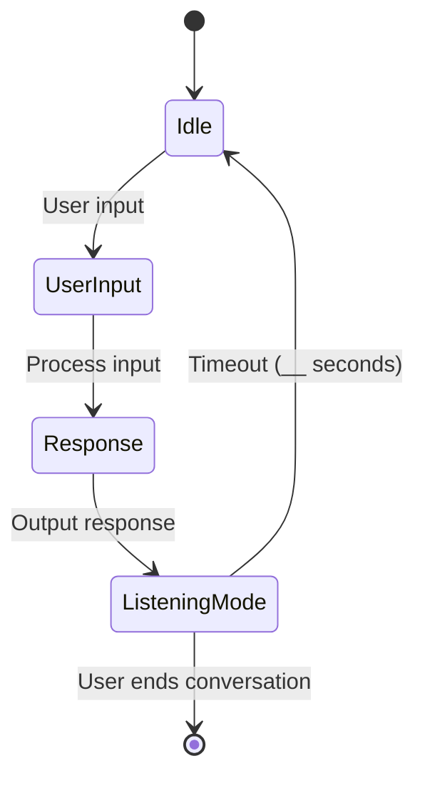
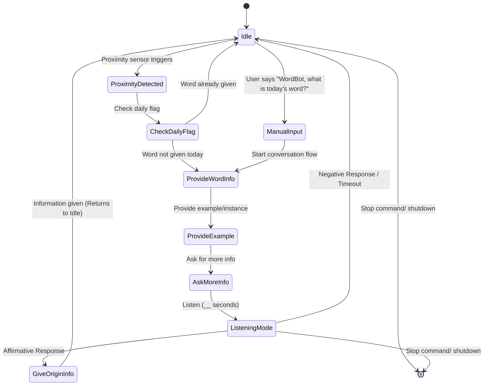

# Chatterboxes: Speech-Enabled Conversational Device

**Collaborators:**  
N/A.

---

## Project Overview

This project involves designing interaction with a speech-enabled device that listens and talks, excluding control of lights (covered in a prior lab). The focus is on audio as the main interaction modality, using speech-to-text, text-to-speech, and AI-powered conversation to create engaging dialogues.

---

# Part 1A. Setup & Technical Demos

This section covers coding tasks demonstrating proficiency with the core technologies.  

### Text-to-Speech Demo

- **Greeting Script:** [my_greeting.sh](https://github.com/ji227/Jesse-Iriah-s-Lab-Hub/blob/Fall2025/Lab%203/Deliverables/my_greeting.sh)  
  - *Content:* A shell script using a text-to-speech engine to output ""Greetings, Jesse Iriah. Welcome to Lab Three."  

### Speech-to-Text Demo

- **Numerical Input Script:** [numerical_input.sh](https://github.com/ji227/Jesse-Iriah-s-Lab-Hub/blob/Fall2025/Lab%203/Deliverables/numerical_input.sh)   
  - *Content:* A shell script that verbally requests a 5 digit zip code and records the user's response via STT.
- **Demo** [Speech-To-Text Demo](https://drive.google.com/file/d/1Nquf9G7CIFVJoUvhF09xIDaz4nv7Oc_Q/view?usp=sharing)
  - *Content:* Aa demonstration video of the speech-to-text function, where the user asks:  
*“What’s the largest continent?”* and the system responds.

### AI-Powered Conversations with Ollama

- **Voice Assistant Documentation:** [OLLAMA Voice Assistant Documentation](https://docs.google.com/document/d/1MC8Soh6y-xnqsH4-R49oLbx3axFsuhnrAuuwzcrkruw/edit?tab=t.0)  
  - *Content:* Documentation outlining technical challenges like STT/TTS issues, Ollama latency, and voice clarity improvements.  
- **Ollama Voice Assistant Script:** [final_voice_assistant.py](https://github.com/ji227/Jesse-Iriah-s-Lab-Hub/blob/Fall2025/Lab%203/Deliverables/final_voice_assistant.py)

---

# Part 1B. Design & Dialogue Elicitation

This section focuses on initial design and role-playing exercises.

### Storyboard & Initial Design

- **Design Documentation:** [Wordbot Documentation (Pt1)](https://docs.google.com/document/d/13Gwjj5X3j9nWW3U7r54Km0AkHF1IowsGNWMSfG7pEe8/edit?tab=t.0)  
  - *Content:* Complete (collated) documentation for the Wordbot project which includes design process, scripts, storyboard, peer review, redesign etc.    
- **Storyboard:** [Storyboard Google Doc](https://github.com/ji227/Jesse-Iriah-s-Lab-Hub/blob/Fall2025/Lab%203/Deliverables/WordBot%20StoryBoard.jpg)
- **State diagram:**

### Dialogue Script

- **Initial Script:** [WORDBOT Script](https://docs.google.com/document/d/1t9Ip9DpQih5_yKYYBYtNqrnhIPVMiVl7mqFzCLVfRVg/edit?tab=t.0)  
- **Process Description:** [Development Process](https://github.com/ji227/Jesse-Iriah-s-Lab-Hub/blob/Fall2025/Lab%203/Deliverables/Wordbot%20Design%3AProcess.png)

### Acting out the Dialogue

- **Dialogue Recording:** [Wordbot Dialogue.mp3](https://github.com/user-attachments/files/22690623/Wordbot.Dialogue.mp3)
- **Reflection/ Review:** [Wordbot Review/Reflection](https://github.com/ji227/Jesse-Iriah-s-Lab-Hub/blob/Fall2025/Lab%203/Deliverables/Wordbot%20Peer-Review.pdf)
  - *Contribution Note:* This review and reflection was performed with Kyle acting as the user/peer-reviewer.

### Wizarding with the Pi (Optional)

- (Include your notes or delete if not completed.)

---

# Part 2. Redesign and Testing

This section addresses the prototype redesign and testing phases.

### Prep for Part 2 (Redesign Rationale)

#### 1) What are concrete things that could use improvement in the design of your device? For example: wording, timing, anticipation of misunderstandings...  
One improvement would be managing user uncertainty during the dialogue flow, as identified during the peer-review. The slight pause/  hesitancy after receiving the definition and example showed that the system needs to proactively suggest the next step. To do this, the final response must be redesigned to explicitly offer the next piece of information. Instead of just stating the example and going silent, the WordBot will now ask, "Would you like more information on its origin?" This makes the next capability clear to the user, guiding them to continue the conversation with a simple "Yes." or "Tell me more."   

Another  improvement is changing the current intrusive initiation (where the device manually asks, "Hello, would you like today’s word?"). This will be replaced with contextual initiation based on sensor input.  

#### 2) What are other modes of interaction beyond speech that you might also use to clarify how to interact?   
Two non-speech modalities will be integrated to improve user experience:   
- First, a proximity/presence sensor will be used to enable contextual initiation. This will ensure the WordBot only offers the daily word after detecting a user nearby, addressing the concern that a non-critical tool should not proactively interrupt. The system will then revert to a prompt-only state after one activation per day.  
- Second, visual feedback (e.g. blinking lights or color changes) will be used to manage the unavoidable Ollama latency. A static green light will indicate the system is ready and listening, while a slowly blinking yellow or blue light will show that the Ollama model is "Accessing the Archives" or processing the query. This visual cue helps manage the user's expectation during the delay.  

#### 3) Make a new storyboard, diagram and/or script based on these reflections.  
- **Revised Script:** [WORDBOT Script Revision] (https://github.com/ji227/Jesse-Iriah-s-Lab-Hub/blob/Fall2025/Lab%203/Deliverables/Wordbot%20Script%20(Revised).pdf)
- **State Diagram:** 

### Prototype your system

- **System Documentation:** [System Design Document](link_to_system_doc) detailing sensors used, component interactions etc.
- **System Script:** [System Script](link_to_system_script) 
- **Video/Screencaptures:** [System Demo Videos](link_to_video_or_screencaps)

## Test the system

### What worked well about the system and what didn't?

***your answer here***

### What worked well about the controller and what didn't?

***your answer here***

### What lessons can you take away from the WoZ interactions for designing a more autonomous version of the system?

***your answer here***

### How could you use your system to create a dataset of interaction? What other sensing modalities would make sense to capture?

***your answer here***

---

# Sources

- List any references, tutorials, libraries, or resources used.

---

**Note:** Replace all placeholder links `link_to_...`, YouTube IDs, and file paths with your actual URLs, paths, and video IDs.

---

This README uses Markdown headings for clear sectioning, bullet points for concise info, embedded images and videos to show proof, and placeholders for your testing reflections and sources. It is ready for direct use or further customization. Let me know if you want me to generate this with your specific links included.

