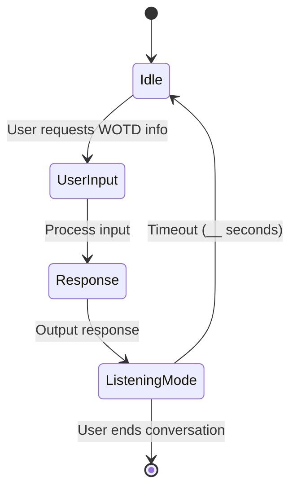
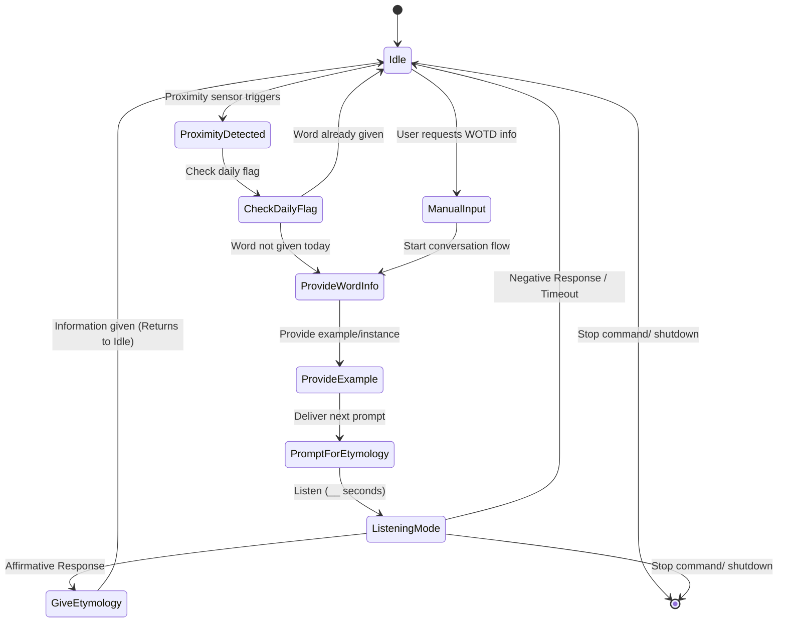

# Chatterboxes: Speech-Enabled Conversational Device

**Collaborators:**  
N/A.

---

## Project Overview

This project involves designing interaction with a speech-enabled device that listens and talks, excluding control of lights (covered in a prior lab). The focus is on audio as the main interaction modality, using speech-to-text, text-to-speech, and AI-powered conversation to create engaging dialogues.

---

# Part 1A. Setup & Technical Demos

This section covers coding tasks demonstrating proficiency with the core technologies.  

### Text-to-Speech Demo

- **Greeting Script:** [my_greeting.sh](https://github.com/ji227/Jesse-Iriah-s-Lab-Hub/blob/Fall2025/Lab%203/Deliverables/my_greeting.sh)  
  - *Content:* A shell script using a text-to-speech engine to output ""Greetings, Jesse Iriah. Welcome to Lab Three."  

### Speech-to-Text Demo

- **Numerical Input Script:** [numerical_input.sh](https://github.com/ji227/Jesse-Iriah-s-Lab-Hub/blob/Fall2025/Lab%203/Deliverables/numerical_input.sh)   
  - *Content:* A shell script that verbally requests a 5 digit zip code and records the user's response via STT.
- **Demo** [Speech-To-Text Demo](https://drive.google.com/file/d/1Nquf9G7CIFVJoUvhF09xIDaz4nv7Oc_Q/view?usp=sharing)
  - *Content:* A demonstration video of the speech-to-text function, where the user asks:  
*“What’s the largest continent?”* and the system responds.

### AI-Powered Conversations with Ollama

- **Voice Assistant Documentation:** [OLLAMA Voice Assistant Documentation](https://docs.google.com/document/d/1MC8Soh6y-xnqsH4-R49oLbx3axFsuhnrAuuwzcrkruw/edit?tab=t.0)  
  - *Content:* Documentation outlining technical challenges like STT/TTS issues, Ollama latency, and voice clarity improvements.  
- **Ollama Voice Assistant Script:** [final_voice_assistant.py](https://github.com/ji227/Jesse-Iriah-s-Lab-Hub/blob/Fall2025/Lab%203/Deliverables/final_voice_assistant.py)

---

# Part 1B. Design & Dialogue Elicitation

This section focuses on initial design and role-playing exercises.

### Storyboard & Initial Design

- **Design Documentation:** [Wordbot Documentation (Pt1)](https://docs.google.com/document/d/13Gwjj5X3j9nWW3U7r54Km0AkHF1IowsGNWMSfG7pEe8/edit?tab=t.0)  
  - *Content:* Complete (collated) documentation for the Wordbot project which includes design process, scripts, storyboard, peer review, redesign etc.    
- **Storyboard:** [Storyboard Google Doc](https://github.com/ji227/Jesse-Iriah-s-Lab-Hub/blob/Fall2025/Lab%203/Deliverables/WordBot%20StoryBoard.jpg)
- **State diagram:**

  
### Dialogue Script

- **Initial Script:** [WORDBOT Script](https://docs.google.com/document/d/1t9Ip9DpQih5_yKYYBYtNqrnhIPVMiVl7mqFzCLVfRVg/edit?tab=t.0)  
- **Process Description:** [Development Process](https://github.com/ji227/Jesse-Iriah-s-Lab-Hub/blob/Fall2025/Lab%203/Deliverables/Wordbot%20Design%3AProcess.png)

### Acting out the Dialogue

- **Dialogue Recording:** [Wordbot Dialogue.mp3](https://github.com/user-attachments/files/22690623/Wordbot.Dialogue.mp3)
- **Reflection/ Review:** [Wordbot Review/Reflection](https://github.com/ji227/Jesse-Iriah-s-Lab-Hub/blob/Fall2025/Lab%203/Deliverables/Wordbot%20Peer-Review.pdf)
  - *Contribution Note:* This review and reflection was performed with Kyle acting as the user/peer-reviewer.

### Wizarding with the Pi (Optional)
- **Reflection/ Review:**

---

# Part 2. Redesign and Testing

This section addresses the prototype redesign and testing phases.

### Prep for Part 2 (Redesign Rationale)

#### 1) What are concrete things that could use improvement in the design of your device? For example: wording, timing, anticipation of misunderstandings...  
One improvement would be managing user uncertainty during the dialogue flow, as identified during the peer-review. The slight pause/  hesitancy after receiving the definition and example showed that the system needs to proactively suggest the next step. To do this, the final response must be redesigned to explicitly offer the next piece of information. Instead of just stating the example and going silent, the WordBot will now ask, "Would you like more information on its origin?" This makes the next capability clear to the user, guiding them to continue the conversation with a simple "Yes." or "Tell me more."   

Another  improvement is changing the current intrusive initiation (where the device manually asks, "Hello, would you like today’s word?"). This will be replaced with contextual initiation based on sensor input.  

#### 2) What are other modes of interaction beyond speech that you might also use to clarify how to interact?   
Two non-speech modalities will be integrated to improve user experience:   
- First, a proximity/presence sensor will be used to enable contextual initiation. This will ensure the WordBot only offers the daily word after detecting a user nearby, addressing the concern that a non-critical tool should not proactively interrupt. The system will then revert to a prompt-only state after one activation per day.  
- Second, visual feedback (e.g. blinking lights or color changes) will be used to manage the unavoidable Ollama latency. A static green light will indicate the system is ready and listening, while a slowly blinking yellow or blue light will show that the Ollama model is "Accessing the Archives" or processing the query. This visual cue helps manage the user's expectation during the delay.  

#### 3) Make a new storyboard, diagram and/or script based on these reflections.  
- **Revised Script:** [WORDBOT Script Revision] (https://github.com/ji227/Jesse-Iriah-s-Lab-Hub/blob/Fall2025/Lab%203/Deliverables/Wordbot%20Script%20(Revised).pdf)
- **State Diagram:** 

  
### Prototype your system

- **System Documentation:** [Wordbot Prototype Documentation](https://github.com/ji227/Jesse-Iriah-s-Lab-Hub/blob/Fall2025/Lab%203/Deliverables/Wordbot%20Prototype%20Documentation.pdf)  
  - *Content:* Describes hardware setup, sensor/RGB integration, Ollama language model, and state flow.  
- **Hardware (Sensor & RGB) Test Script:** [RGB & Sensor Test Script](https://github.com/ji227/Jesse-Iriah-s-Lab-Hub/blob/Fall2025/Lab%203/Deliverables/sensor_and_rgb_test.py)  
  - *Content:* Script for verifying VCNL4040 sensor triggering and PiTFT RGB display feedback during development.  
- **Hardware (Sensor & RGB) Test Script Demo:** [Hardware Test Script](https://drive.google.com/file/d/1El91XUt4rTHmSPmdlPCDypnxZY37Om7s/view?usp=sharing)  
  - *Content:* Video of the test script with hand approach triggering color changes and live proximity values on display.  
- **Complete System Script:** [Wordbot Script]([link_to_system_script](https://github.com/ji227/Jesse-Iriah-s-Lab-Hub/blob/Fall2025/Lab%203/Deliverables/wordbot.py))  
  - *Content:* Main Wordbot code integrating speech recognition, TTS, proximity, display, and Ollama for natural dialogue.   
- **Video/Screencaptures:** [Wordbot Live Demo](https://drive.google.com/file/d/1ibcdPk0tkAVUzXTxxm05ir3aHmEtbXNk/view?usp=sharing)  
  - *Content:* Full demo of Wordbot in operation, showing user interaction with sensor, audio prompts, TTS replies, and RGB feedback.  
### Test the system

**What worked well about the system and what didn't?**  
Pre-integration testing of individual components proved highly beneficial, enabling isolation and resolution of hardware-level issues prior to coding the final state machine. The implemented redesigns showed success in several areas:
- The proximity sensor reliably provided non-intrusive activation, transitioning the system from idle (green) to listening (red).
- The visual status Protocol (green → red → yellow → green) effectively managed user expectations during the inherent Ollama latency, aligning with the redesign goals.
- The proactive prompt ("Would you like to hear about its origin?")  guided users toward the etymology follow-up, mitigating user uncertainty observed in peer review.
However, Ollama latency remains a limiting factor due to the Raspberry Pi’s hardware constraints running the LLM. Additionally, the LLM’s tendency to generate conversational filler required defensive parsing logic in the Python script to reliably extract structured data.

**What worked well about the controller and what didn't?**  
The VCNL4040 proximity sensor functioned effectively as the primary non-contact controller for system wake-up and state reset. The Microphone/STT reliably served as the secondary verbal controller for dialog interactions.   
The system lacks manual physical controls (e.g. buttons). If the conversation stalls due to STT timeout, there isn't really a recovery. The PiTFT screen functions solely as an output device without input control capabilities.

**What lessons can you take away from the WoZ interactions for designing a more autonomous version of the system?**
Conversational latency is identified as a critical failure point for autonomous systems. The smooth flow seen during the Wizard of Oz sessions couldn’t be replicated automatically because of the response delays in the LLM. Future designs should consider:  
- Pre-computation: Pre-load and parse word data during idle state to enable instantaneous transition to delivery once activated.
- Explicit Recovery: Include a physical override (button) to allow immediate system reset from any state, providing a reliable user escape in case of verbal or timing failures.
- STT Confirmation: Implement verbal confirmation for ambiguous user inputs prior to proceeding, a function implicitly handled by the “wizard” during WoZ studies.

**How could you use your system to create a dataset of interaction? What other sensing modalities would make sense to capture?**
The system’s  operation can generate a  dataset logging human-device interactions including:  
- System states and timestamps: start and end times for each state transition.
- Input data: Proximity sensor values at activation and raw STT transcripts.
- Latency measurements: Duration of Ollama processing during the processing state.
- System outputs: Exact TTS utterances delivered.   
Additional sensing modalities that could enhance analysis include:  
- Ambient light sensors: To correlate environmental lighting with user response to visual status cues.
- Microphone noise level (dB): To assess the impact of ambient noise on STT success and timeout rates.
- Physical user inputs: Buttons or touch sensors as fallback/override controls.

---

# Sources

- Adafruit VCNL4040 Library
- Adafruit RGB Display (ST7789) Library
- gTTS Python Library
- SpeechRecognition Python Library
- Ollama LLM API / Client
- Python PIL Imaging for Display Control

---

This README uses Markdown headings for clear sectioning, bullet points for concise info, embedded images and videos to show proof, and placeholders for your testing reflections and sources. It is ready for direct use or further customization. Let me know if you want me to generate this with your specific links included.

