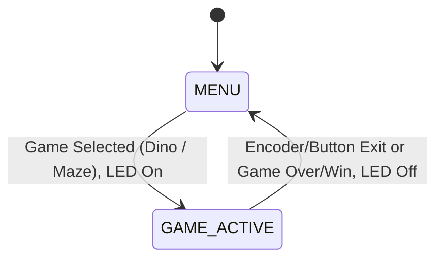

# Ph-UI!!!

**Collaborators:**  
Kyle Li.

---

## Lab Overview

This project explores physical user interfaces on the Raspberry Pi, focusing on sensor integration and prototyping new device forms. The goal is to use capacitive, light/proximity, gesture, rotary encoder, joystick, and distance sensors—then design the physical interaction and display for a new device.

---

## Part 1
### A. Capacitive Sensing

- **Setup:** Connected capacitive sensor to Pi using conductive materials from kit.
- **Test Video:**  
  [Capacitive Sensor Test](https://drive.google.com/drive/folders/1k5EjLj52QXkYCU0cCGVUmvABz0LI8WAS)  
  *This video shows the sensor hardware, Pi, and terminal output as clips are touched.*
- **Code:**  
  [cap_test.py](https://github.com/ji227/Jesse-Iriah-s-Lab-Hub/blob/Fall2025/Lab%204/cap_test.py)
- **Terminal Output:**  
  - Touching black alligator clip:  
    `Twizzler 0 touched!`
  - Touching white alligator clip:  
    `Twizzler 1 touched!`
  
---

### B. More Sensors

#### 1. Light/Proximity/Gesture Sensor (Adafruit APDS-9960)
- **Videos:**  
  - [Light Test](https://drive.google.com/file/d/1ynyXdRq7TfnPcbY4HaUFE6u_20OG_65H/view?usp=sharing)
  - [Proximity Test](https://drive.google.com/file/d/1AJwVIZ33KkiBfIbnyfk7PMNJ0pQdXZVZ/view?usp=sharing)
  - [Gesture Test](https://drive.google.com/file/d/1MKmHFrpkHARHvOo0EEXghPhEa9gxnTVY/view?usp=sharing)
- **Code:**  
  - [color_test.py](https://github.com/IRL-CT/Interactive-Lab-Hub/blob/Fall2025/Lab%204/color_test.py)
  - [proximity_test.py](https://github.com/IRL-CT/Interactive-Lab-Hub/blob/Fall2025/Lab%204/proximity_test.py)
  - [gesture_test.py](https://github.com/ji227/Jesse-Iriah-s-Lab-Hub/blob/Fall2025/Lab%204/gesture_test.py)
- **Terminal Output:**  
  - Color sensor output (~0.5s updates):
    ```
    red:  145
    green:  223
    blue:  124
    clear:  300
    color temp 5600
    light lux 290
    ```
  - Proximity sensor output (~0.2s updates):
    ```
    38
    40
    39
    ```
  - Gesture sensor output on detected gestures:
    ```
    up
    down
    left
    right
    ```

#### 2. Rotary Encoder
- **Video:**  
  [Rotary Encoder Test](https://drive.google.com/drive/folders/1k5EjLj52QXkYCU0cCGVUmvABz0LI8WAS)
- **Code:**  
  [encoder_test.py](https://github.com/ji227/Jesse-Iriah-s-Lab-Hub/blob/Fall2025/Lab%204/encoder_test.py)
- **Terminal Output:**
  	```
  	Found product 4991
	Position: 0
	Position: 1
	Position: 2
	Button pressed
	Button released
  	```

#### 3. Joystick
- **Video:**  
  [Joystick Test](https://drive.google.com/file/d/12tLrw4grtVd-AorB-V6PifySKMY9VJEA/view?usp=sharing)
- **Code:**  
  [joystick_test.py](https://github.com/IRL-CT/Interactive-Lab-Hub/blob/Fall2025/Lab%204/joystick_test.py)
- **Terminal Output:**  
	```
  	X: 507, Y: 524, Button: 1
	X: 750, Y: 300, Button: 1
	X: 512, Y: 512, Button: 0
 	```

#### 4. Distance Sensor
- **Video:**  
  [Distance Sensor Test](https://drive.google.com/file/d/1x9kApo4Re5UTOoBUEivQTzrcoP8KNI6Q/view?usp=sharing)
- **Code:**  
  [qwiic_distance.py](https://github.com/IRL-CT/Interactive-Lab-Hub/blob/Fall2025/Lab%204/qwiic_distance.py)
- **Terminal Output:**  
	```
  	SparkFun Proximity Sensor VCN4040 Example 1
	Proximity Value: 38
	Proximity Value: 40
	Proximity Value: 39
 	```

---

### C. Physical Sensing Design

- **Sketches:**  
	

- **Reflection - What are some things these sketches raise as questions? What do you need to physically prototype to understand how to anwer those questions?**  
  The five sketches explore different physical forms inspired by classic 90s retro gaming devices and handheld consoles, focusing on a simple, recognizable style suitable for a 2D platformer game. The designs reflect iconic shapes such as a Gameboy, PSP, arcade machine, laptop keyboard layout, and a video game controller, each incorporating buttons and dials positioned for intuitive jump/duck and volume control interactions. These different formats raise design questions related to ergonomics, button placement, user comfort, and control intuitiveness. For example, the portability of the Gameboy contrasts with the immersive feel of an arcade machine setup. The sketches also highlight challenges in balancing screen visibility, control accessibility, and housing size.
  
  Key questions for prototyping include how button size and spacing affect rapid jump/duck input, the dial placement’s ease of use for volume control, and how different device shapes accommodate sustained gameplay without fatigue.
  
  Physical prototypes are needed to test button spacing, size, and placement relative to hand reach and movement. Also, the dialing mechanism for volume control requires testing for tactile feedback and ease of adjustment.   

- **Prototype Selection:**    
  The Gameboy-inspired layout was selected for prototyping due to its compact size, ergonomic button placement, and familiarity, which promises a user-friendly interaction experience.  

---

### D. Display & Housing

- **Sketches:**  
  *Placeholder for 5 display/button/knob positioning sketches.*
  
  - *Content:* Five layout designs were created for the Gameboy-style device, varying the physical positions of the OLED display, jump and duck buttons, and the rotary volume dial:

- **Reflection:**  
  *Short explanation about questions raised during sketching, and what needs to be prototyped to answer those questions.*
  These sketches raised design questions including:  
  - How does the positioning of buttons affect reachability and prevent accidental presses?
  - What button sizes best balance quick access and comfort?
  - Where should the rotary dial be placed for intuitive volume control without interfering with gameplay?
  - How visible is the display from natural holding angles during active use?
  - Does the form factor allow comfortable grip and sustained interaction without fatigue?  
  
  Physical cardboard prototypes are needed to test the ergonomics of button and dial placement, the comfort of the grip while holding the device, and display visibility at typical viewing angles. Prototyping will help answer tactile feedback and spacing challenges that sketches alone cannot resolve.  

- **Integrated Design Selection:**  
  *Note which display/housing design will be used in your prototype and the rationale for selection (e.g. size, simple interface, visibility).*  
  The Gameboy-inspired layout was initially selected for prototyping due to its compact size, ergonomic button placement, and familiarity.  The first layout—centered display with symmetrical buttons below and rotary dial on the top edge—was chosen. This design balances symmetry for easy ambidextrous use and places controls where thumbs naturally rest while holding the device. The size and positioning ensure the screen is clearly visible during play.  

- **Final Prototype:**  
  *Include photos or video documenting your prototype. Paste link, image, or video embed here.*
  The final design incorporates a **Waveshare 2.23-inch OLED Hat** and replaces the capacitive buttons with the **Rotary Encoder** and **Joystick** for a robust, dedicated control interface.
  - Component update & connectivity: The final configuration utilizes the **Waveshare 2.23-inch OLED Hat** (wide screen), which mounts directly onto the Raspberry Pi's **40 GPIO pins**. An **I2C SHIM** is physically sandwiched between the display and the Pi to provide accessible I2C connections for the external **Rotary Encoder** and **Joystick**. All three components (Display, Encoder, Joystick) communicate using the I2C protocol.
  - Component measurements (approximate):  
	  
      
      

  - Cardboard prototype:
  	- Description: *The cardboard prototype represents the physical realization of the Gameboy-inspired design, allowing for ergonomic validation of the selected components. The final arrangement features the Waveshare 2.23-inch OLED Hat display centered at the top, mounted directly to the Raspberry Pi. The key interactive components, the Rotary Encoder (bottom-left) and the Joystick (bottom-right), are symmetrically placed for intuitive two-handed control, replacing the initial capacitive button concept. To manage the hardware connections, an I2C SHIM is sandwiched between the display and the Pi, providing I2C access for the external controls. This layout and construction allow for testing the grip comfort and the placement of controls relative to the user's natural hand position during play, effectively transitioning from the sketched concept to a physical model for validation.*   
 		


## Part 2
### E. Multi-Device Demo
The multi-device prototype implements a handheld, retro-inspired game console prototype featuring two input devices and two output devices integrated via Raspberry Pi. Inputs include a **Qwiic Joystick** for directional control and button presses, and a **Rotary Encoder** for menu navigation and selection. Outputs consist of a **Waveshare 2.23" OLED Display HAT** delivering real-time monochrome visual feedback, and a **Qwiic Button** with an integrated green LED that acts as a state indicator during gameplay and turning off in menus.

The design draws inspiration from classic 90s handheld gaming consoles, emphasizing functional placement for intuitive, comfortable control during play. It supports two geometry-themed games—a DINO-inspired runner and a Maze puzzle—each utilizing different control schemes while providing visually distinct feedback through the OLED screen and LED indicator. The overall system demonstrates a playful yet functional approach to chaining physical interfaces and outputs in a compact form factor.

- **Demo Code & Video:**  
  - *Code:* [geometry_game.py](https://github.com/ji227/Jesse-Iriah-s-Lab-Hub/blob/Fall2025/Lab%204/Deliverables/geometry_game.py)
  - *Videos:*
 	 - Game 1 (Geometry Runner) Demo: https://drive.google.com/drive/folders/1k5EjLj52QXkYCU0cCGVUmvABz0LI8WAS
 	 - Game 2 (Maze) Demo: https://drive.google.com/drive/folders/1k5EjLj52QXkYCU0cCGVUmvABz0LI8WAS

- **Interaction Diagram/Sketch:**
- Comments: *The diagram below shows the fixed physical arrangement of components: The **OLED Display** is centered at the top. The **Raspberry Pi** is placed upside down to route the USB-C power cable out the top-right corner. The rotary encoder is on the bottom-left, and the joystick is on the bottom-right. The I2C SHIM's role as the connection point is highlighted.*
 		

- **State Machine Diagram:**
- Comments: *The state machine diagram below illustrates the device's entire user flow, detailing transitions between the Menu and the two game states.*


  
- **Reflection:**  
  *Multi-input/Multi-Output Chaining Reflection*  
	- System Integration and Interface Chaining: Integrating multiple I2C/Qwiic and SPI devices (Joystick, Rotary Encoder, OLED display, Qwiic Button LED) significantly increased system interactivity beyond single-component operation. The compact handheld form factor was achieved by using an I2C SHIM to access the bus while the display HAT occupied the main GPIO header, demonstrating a practical solution for pin conflicts.
	- New Types of Interaction (Multi-Input/Multi-Output): Combining the two inputs allows for multi-modal interaction where roles can be assigned by context. For instance, the Rotary Encoder is mapped to discrete menu selection, leveraging its precision and detents, while the Joystick is reserved for continuous positional or velocity control within a game. The Qwiic Button LED provides a new, non-visual feedback channel that augments the OLED display by providing unambiguous state indication ("active gameplay").
	- Device Role and Arrangement Effects:
		- Physical Arrangement: The symmetrical placement of the Rotary Encoder and Joystick on the cardboard chassis was validated for improved grip comfort and two-handed control. The "upside-down Pi" setup was a functional arrangement decision made specifically to manage power cable routing and maintain primary interaction space.
		- Swapping Primary/Secondary: Observing the system behavior highlighted that the Joystick naturally serves as the primary input for directional game control, while the Encoder's push-button function is highly effective as a dedicated secondary input (e.g., a rapid "back to menu" command), confirming component suitability for specific tasks.
	- Challenges and Constraints: The primary challenge was the strict 128x32 display resolution, which severely constrained the visual complexity of both the Geometry Runner and Maze Game. Furthermore, verifying input and output response times across the chained I2C and SPI buses required careful testing to ensure fluid gameplay.

- **Feedback:**
The prototype was demonstrated to Angela and Iqra, who offered feedback on potential enhancements and future directions. Both noted that adding sound output or haptic feedback could further highlight key gameplay moments, such as successful movements or collisions. The system could be expanded to include multiple lights or colors for distinguishing between different games or states, enhancing visual feedback. A suggestion was made to integrate player customization options, such as selecting sprite shapes or LED colors, to increase engagement. Overall, the handheld form factor and control layout were considered intuitive, but further sensory feedback modes and personalization features would create a richer user experience.
  
---

### F. Final Documentation

**Looks Like (Aesthetics and Form Factor)**
The final prototype adopts a simple, two-handed handheld console form factor, adhering to the Gameboy-inspired sketches. The chassis uses rigid cardboard and masking tape to achieve a fixed, compact enclosure suitable for ergonomic testing. The Waveshare 2.23-inch OLED Display HAT is centrally positioned at the top for optimal screen visibility. The Rotary Encoder and Qwiic Joystick are mounted symmetrically below the display—Encoder on the left, Joystick on the right—to accommodate two-handed control. The separate Qwiic Button LED module is visible at the top edge and acts as the system status indicator. The Raspberry Pi is internally oriented to route the power supply cable away from the grip area, confirming the physical design decisions made during the iteration process.

**Works Like (Functionality and Technical Implementation)**
The system operates as a multi-input/multi-output demonstrator. It utilizes the Joystick for analog directional input and a selection button, and the Rotary Encoder for discrete value changes (menu item selection) and a secondary 'back' button press. The outputs include the 128x32 pixel monochrome display for all visual game feedback and menu rendering, and the integrated Qwiic Button LED for system state indication. The software implements a centralized state machine that controls the active game loop, manages all component inputs, and modulates the Qwiic LED output. The integration of the I2C SHIM successfully facilitated the simultaneous use of the display, Encoder, and Joystick.

**Acts Like (Interaction and User Flow)**
User interaction begins at the MENU state, where the Qwiic LED is OFF. The user rotates the Encoder or uses the Joystick's vertical axis to cycle between the Geometry Runner and Maze Game options. Pressing the Encoder's push-button or the Joystick's integrated button selects the game and initiates the transition. Upon entering a game state, the Qwiic LED turns ON, providing immediate visual confirmation that gameplay is active. Within a game, the Joystick provides the primary input (e.g., jump/duck in Runner, movement in Maze). To exit any game and return to the MENU, the user presses the Encoder's push-button, and the LED instantly switches OFF, confirming the system state change. This flow demonstrates clear, multi-modal feedback essential for an interactive physical device.


**DEMO Snippets**
https://github.com/user-attachments/assets/3e2bab7a-8910-4e71-be9f-d66a5547499a

https://github.com/user-attachments/assets/232e628e-fd51-44e7-aedc-f7ceede9e64b


---

## Additional Notes


The final prototype required the use of the Waveshare 2.23-inch OLED Hat as the main display, as it was a component sourced outside of the provided kit. Documentation for this specific component can be found here: https://www.waveshare.com/wiki/2.23inch_OLED_HAT

---


