# Observant Systems: Interactive Environmental Sensing on Raspberry Pi

**Collaborators:**  
N/A

## Table of Contents
- [Part 1A: System Prep & Sense-Making Demos](#part-1a-system-prep--sense-making-demos)
- [Part 1B: Prototyping an Interaction](#part-1b-prototyping-an-interaction)
- [Part 1C: Testing & Evaluation](#part-1c-testing--evaluation)
- [Part 1D: System Characterization](#part-1d-system-characterization)
- [Part 2: Final System & Demonstration](#part-2-final-system--demonstration)
  
---

## Project Overview

This lab explores nteractive systems that sense and respond to real-world events using a Raspberry Pi 4. The lab focuses on experimenting with various machine learning models for object recognition, gesture detection, and custom classification to build observant systems that can monitor and respond to environmental changes.

---

## Part 1A. System Prep & Sense-Making Demos

### Preparation Steps

- **Hardware Setup:**  
  - Raspberry Pi 5 
  - USB Webcam connected to Pi
  - Development via VNC Viewer from MacBook Pro

- **Software Dependencies Installed:**  
  - PyTorch 2.9.0 & TorchVision 0.24.0
  - OpenCV 4.11.0.86
  - MediaPipe 0.10.18
  - Teachable Machine Lite 1.2.0.2
  - Python 3.11 virtual environment

- **Key Readings:**  
  Reviewed Bellotti et al.'s "Making Sense of Sensing Systems" which emphasized five critical questions for designers: understanding system purpose, considering what information is captured, how information is presented to users, addressing privacy concerns, and evaluating system value versus potential issues.

---

### PyTorch Object Recognition

- **Overview:**  
  Tested the MobileNet v2 classification model running real-time object detection on the Raspberry Pi's CPU. The model can recognize 1000 object classes from the ImageNet dataset.

**Performance Metrics:**
- **FPS:** ~13 frames per second (lower than the advertised 30+ FPS, likely due to Pi CPU load)
- **Resolution:** 144x176 pixels
- **Model:** MobileNet v2 (pre-trained on ImageNet)

**Objects Tested & Results:**

| Object | Classification | Confidence | Notes |
|--------|---------------|------------|-------|
| Coffee Mug | "coffee mug" / "water jug" | 29-53% | Correctly identified with moderate confidence |
| iPhone 8+ | "iPod" | 24-40% | Misclassified but understandable (similar appearance) |
| Amazon Fire Stick Remote | "remote control" | 88-96% | Excellent detection with high confidence |
| Green Apple | "Granny Smith" | 99%+ | Perfect classification! Technically correct apple variety |
| Pen | "ballpoint pen" | 64-86% | Good detection with solid confidence |
| Digital Camera | "Polaroid camera" | 33-48% | Recognized as camera but wrong type |

- **Media:**  
    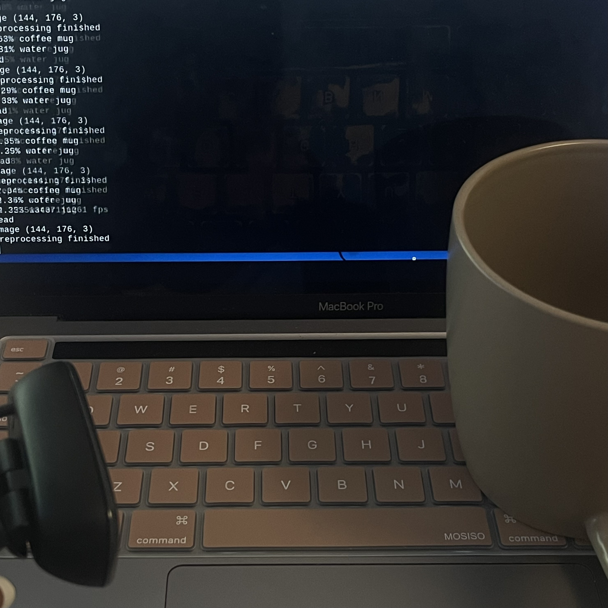
    
    *Coffee mug detected with moderate confidence*
    
    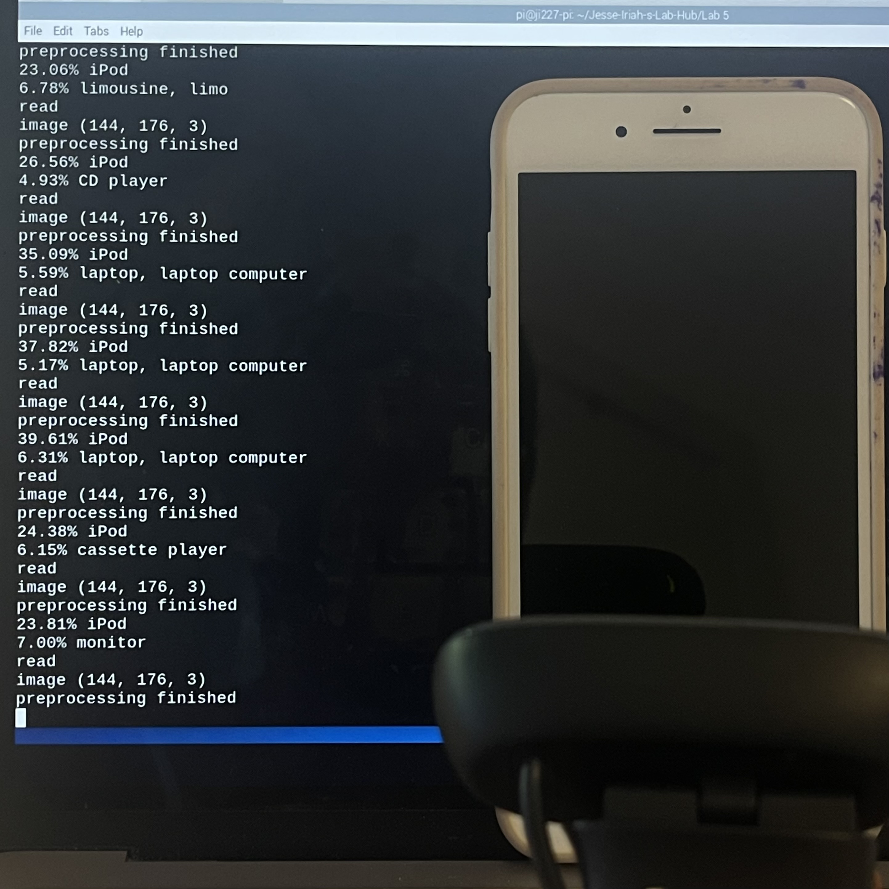
    
    *iPhone misclassified as iPod - common confusion for the model*
    
    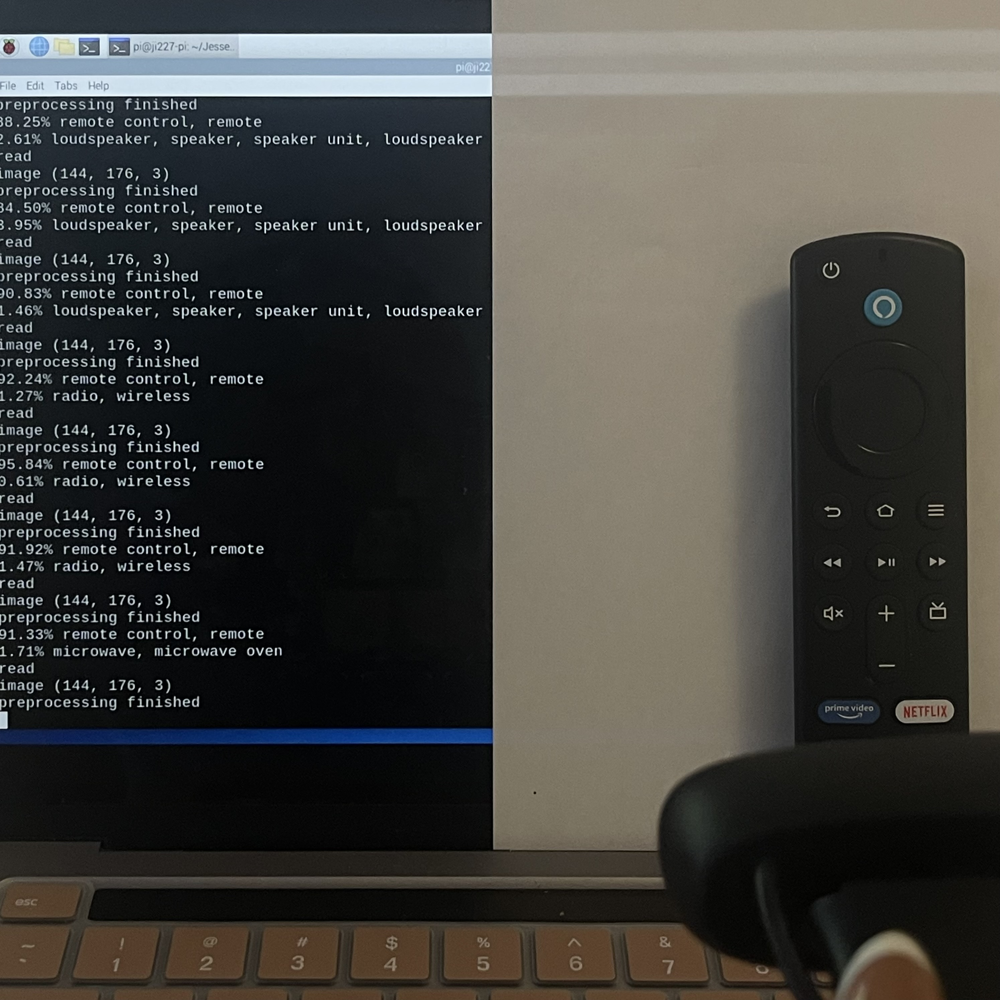 
    
    *Amazon Fire Stick remote detected with 90%+ confidence*
    
    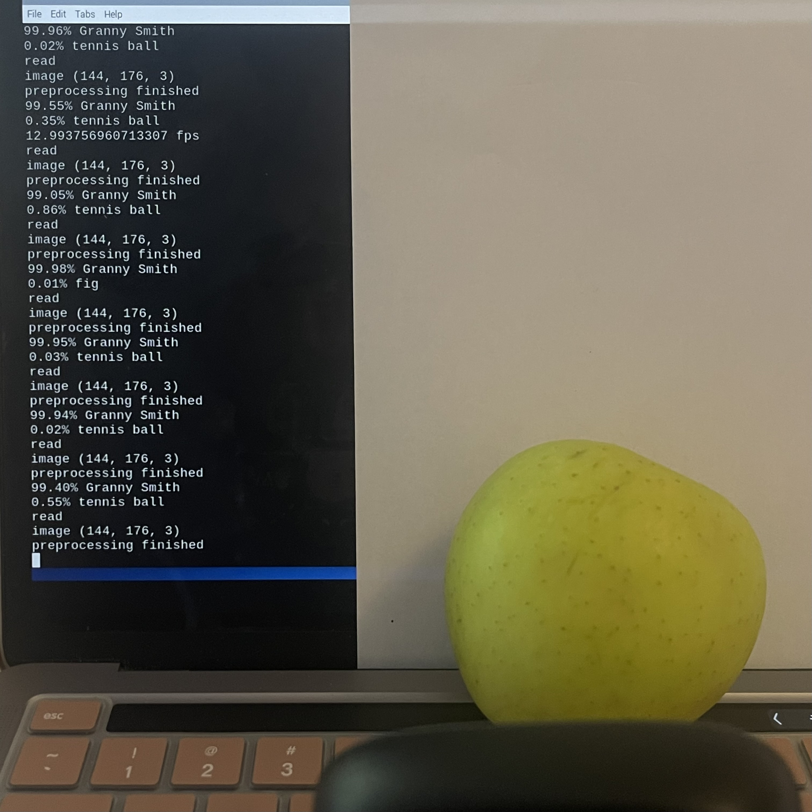
    
    *Green apple correctly identified as "Granny Smith" with 99% confidence*
    
    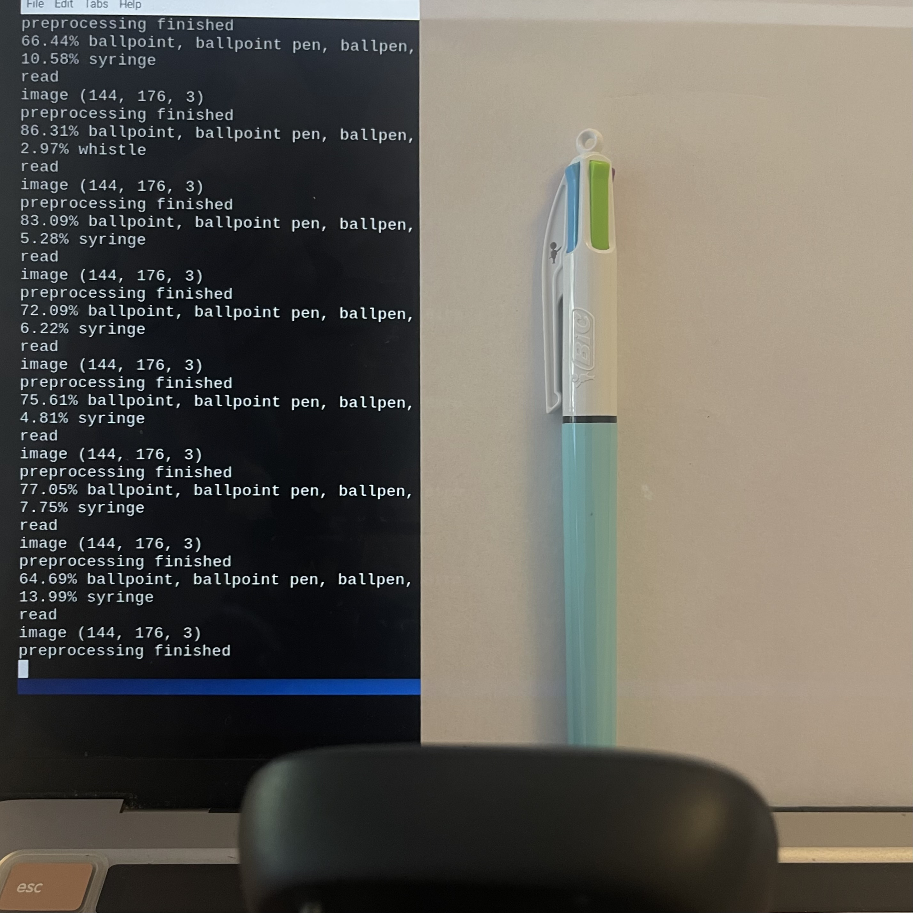
    
    *Ballpoint pen detected with good confidence*
    
    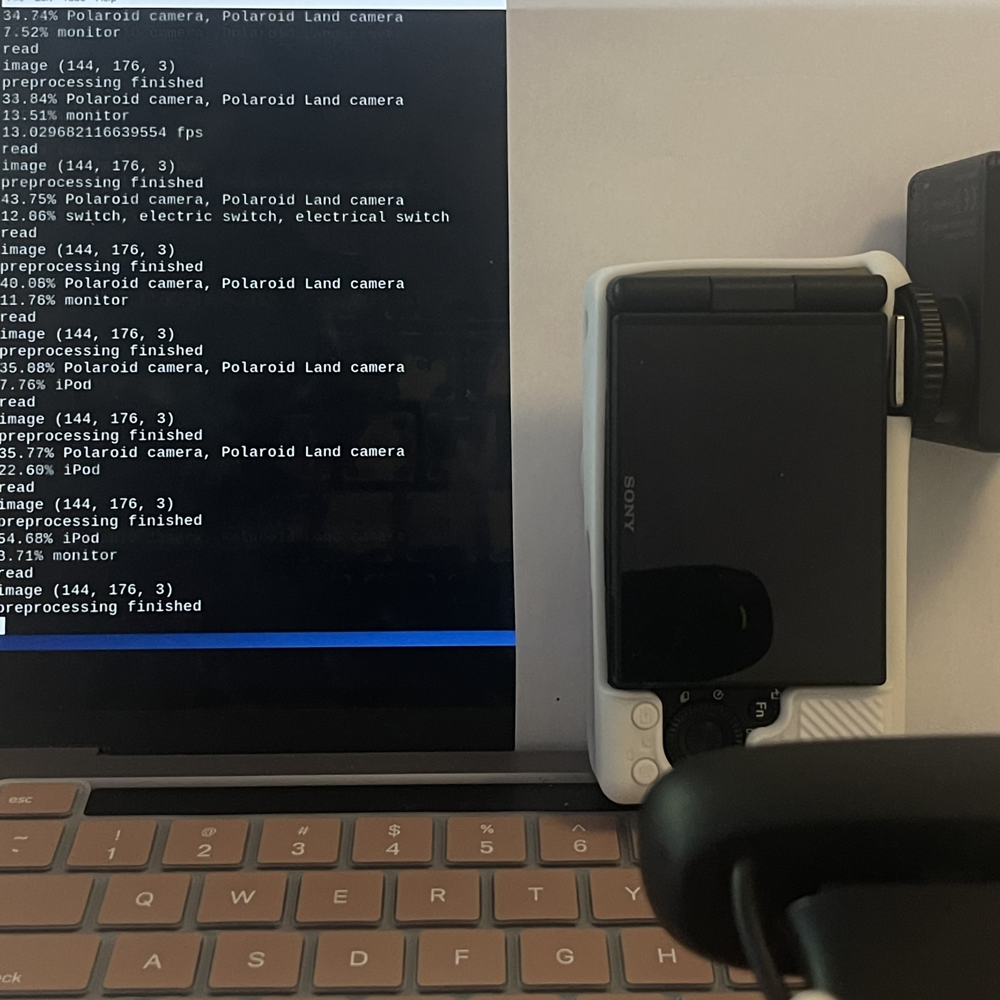
    
    *Digital camera recognized but classified as Polaroid*

**Key Observations:**
- The model performs best with common, distinct objects (apple, remote)
- Similar-looking modern devices get confused (iPhone → iPod)
- Confidence levels vary significantly based on object distinctiveness
- The 13 FPS performance is sufficient for real-time interaction but not as fast as expected
- Round, colorful objects (like the apple) had the highest confidence
- The model shows its ImageNet training bias - it knows "Granny Smith" as a specific class!

**Code Used:**  
`infer.py` with default MobileNet v2 weights

---

### MediaPipe Hand Pose Tracking

**Overview:**  
Tested MediaPipe's hand pose detection system which tracks 21 landmarks on the hand in real-time and translates gestures into control signals.

**Performance Metrics:**
- **FPS:** 8-11 frames per second (slower than PyTorch)
- **Tracking:** 21 hand landmarks with 3D coordinates
- **Gestures Implemented:** Pinching (continuous control) and "Quiet Coyote" (discrete control)

**Gesture Control Mechanisms:**

| Gesture Type | Description | Control Output | Screenshot |
|--------------|-------------|----------------|------------|
| **Pinch** (Continuous) | Thumb and index finger proximity | Percentage value (0-100%) based on finger distance | 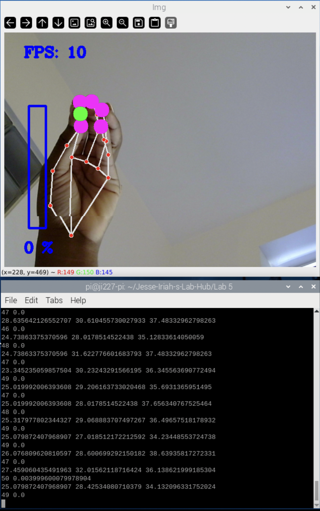 |
| **Quiet Coyote** (Discrete) | Thumb, index, and pinky extended; middle and ring fingers down | Instant jump to preset value (triggers "quiet coyote!" message) | 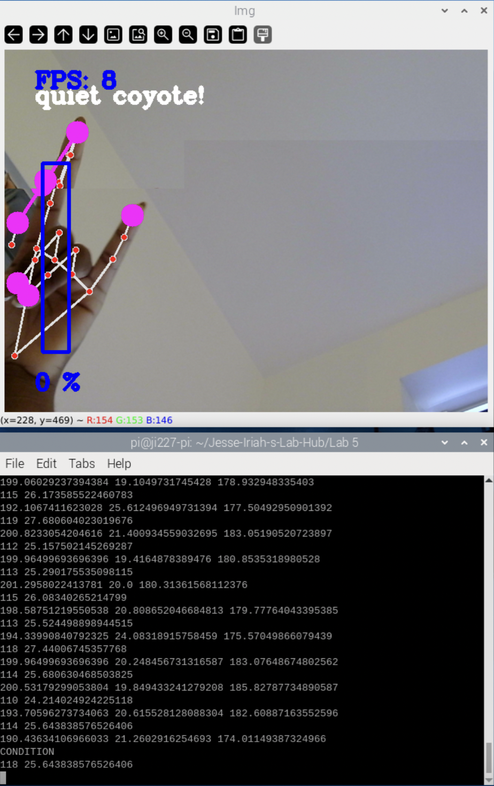 |

**Testing Results:**  
    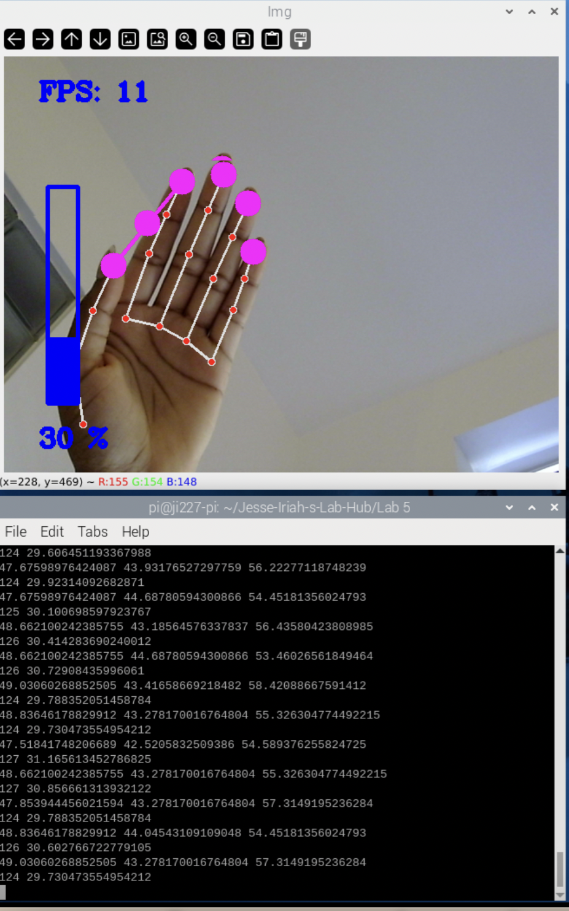  
    *Open hand - all landmarks tracked, showing 30% value*  
    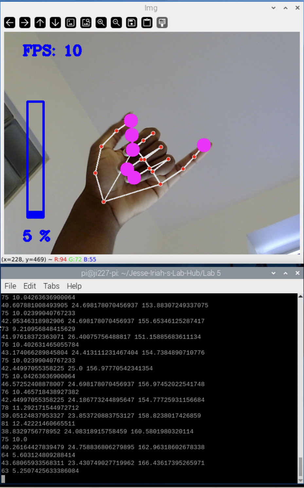    
    *Shaka sign- 5% value, good landmark visibility*  
    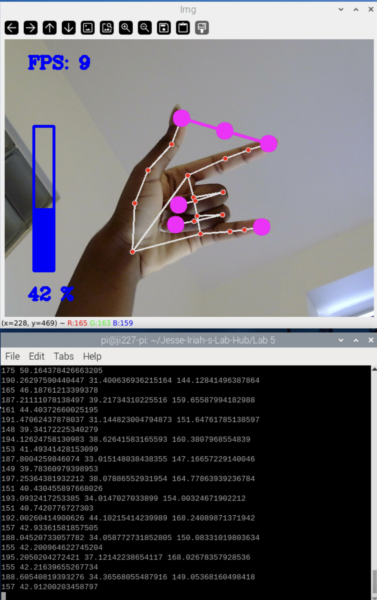    
    *ASML 'I love you' - 42% value, all fingertips clearly marked*  
        
    *Pinch gesture detected -   green indicator dot visible when thumb and index finger come close, showing 0% (fingers fully together)*  
        
    *"Quiet Coyote" gesture recognized - text overlay appears when specific finger configuration is detected*  

**Key Observations:**

**Strengths:**
- Excellent landmark tracking when hand is steady
- Accurately identifies all 21 hand points even with complex finger positions
- Successfully differentiates between different gesture types
- Provides visual feedback (percentage values, gesture labels)
- Works with various hand orientations and positions

**Limitations:**
- **Slow performance:** 8-11 FPS makes interactions feel laggy
- **Motion sensitivity:** Significant lag when hand moves quickly
- **Tracking loss:** Struggles to maintain tracking with rapid hand movements
- **Lighting dependent:** Works best in good, even lighting conditions
- **Frame edge issues:** Can lose tracking if hand moves to edge of camera view
- **Distance sensitivity:** Best tracking at 1-2 feet from camera

**Interaction Design Implications:**

The position-based approach in MediaPipe offers interesting possibilities for UI control:
- **Volume/brightness control** via pinch distance (continuous adjustment)
- **Menu navigation** using finger positions and orientations  
- **Gesture shortcuts** like "Quiet Coyote" for instant actions (pause, reset, etc.)
- **Multi-finger counting** for discrete selection (1-5 fingers up)

This could be integrated with physical UI elements from Lab 4:
- Control servo motor angle via hand rotation
- Adjust rotary encoder values using pinch distance
- Trigger button presses with specific gestures

However, the 8-11 FPS performance limits real-time responsiveness. This system would work better for:
- **Deliberate, slow gestures** rather than quick hand movements
- **Periodic sampling** (every few seconds) rather than continuous control
- **Gesture-triggered events** rather than real-time proportional control

**Code Used:**  
`hand_pose.py` - MediaPipe Hands solution with custom gesture recognition logic

---

### Teachable Machines

- **What you did:**  
  *Summary of training and deploying a custom classifier. Describe how you got your model on the Pi and ran tml_example.py. Compare performance.*

- **Screenshots or Video:**  
    
  

---

## Part 1B. Prototyping an Interaction

- **Selected Model/Tool:**  
  *Which system did you use for interaction prototype? Why?*

- **Interaction Description:**  
  *Describe your prototype: user input, recognition, output. What task or behavior did you implement?*

- **Media (photos, videos, diagrams):**  
    
  

---

## Part 1C. Testing & Evaluation

- **Testing Summary:**  
  *How well did your prototype work? Where did it fail? What did users notice?*

- **Design Improvements:**  
  *List any changes or optimizations you made, like gesture calibration/visual feedback, error correction, added resets, etc.*

- **Impact of Misclassification:**  
  *Describe the effect of detection errors and how your design addresses them.*

---

## Part 1D. System Characterization

- **Intended Use:**  
- **Best/Challenging Environments:**  
- **Failure Modes & Recovery:**  
- **Interaction Feel:**  
  *Write a paragraph or use a markdown table if desired.*

## Part 1D. System Characterization
### What can you use X for?
### What is a good environment for X?
### What is a bad environment for X?
### When will X break?
### How does X feel?

- **Characterization Media:**  
  

---

## Part 2. Final System & Demonstration

- **Final Integration:**  
  *What did you change or improve for the final build? Integrate sensors, add outputs, log data, etc.*

- **Final Demo Video:**  
  

---

## Sources & References

- MediaPipe Python API  
- PyTorch MobileNet  
- Teachable Machines  
- [Bellotti et al.](link-to-paper-if-applicable)  
- Any other documentation or credits

---
