# Observant Systems: Interactive Environmental Sensing on Raspberry Pi

**Collaborators:**  
N/A

## Table of Contents
- [Part 1A: System Prep & Sense-Making Demos](#part-1a-system-prep--sense-making-demos)
- [Part 1B: Prototyping an Interaction](#part-1b-prototyping-an-interaction)
- [Part 1C: Testing & Evaluation](#part-1c-testing--evaluation)
- [Part 1D: System Characterization](#part-1d-system-characterization)
- [Part 2: Final System & Demonstration](#part-2-final-system--demonstration)
  
---

## Project Overview

This lab explores interactive systems that sense and respond to real-world events using a Raspberry Pi 4. The lab focuses on experimenting with various machine learning models for object recognition, gesture detection, and custom classification to build observant systems that can monitor and respond to environmental changes.

**All code, models, and media referenced in this document can be found in the [`Deliverables`](Deliverables/) folder.**
**Demo videos:** [Lab 5 Videos](https://drive.google.com/drive/folders/1LAQ7KSJR5ZazZbtYKrJ5lUNYnUd9axqR?usp=sharing)

---

## Part 1A. System Prep & Sense-Making Demos

### Preparation Steps

- **Hardware Setup:**  
  - Raspberry Pi 5 
  - USB Webcam connected to Pi
  - Development via VNC Viewer from MacBook Pro

- **Software Dependencies Installed:**  
  - PyTorch 2.9.0 & TorchVision 0.24.0
  - OpenCV 4.11.0.86
  - MediaPipe 0.10.18
  - Teachable Machine Lite 1.2.0.2
  - Python 3.11 virtual environment

- **Key Readings:**  
  Reviewed Bellotti et al.'s "Making Sense of Sensing Systems" which emphasized five critical questions for designers: understanding system purpose, considering what information is captured, how information is presented to users, addressing privacy concerns, and evaluating system value versus potential issues.

---

### PyTorch Object Recognition

- **Overview:**  
  Tested the MobileNet v2 classification model running real-time object detection on the Raspberry Pi's CPU. The model can recognize 1000 object classes from the ImageNet dataset.

**Performance Metrics:**
- **FPS:** ~13 frames per second (lower than the advertised 30+ FPS, likely due to Pi CPU load)
- **Resolution:** 144x176 pixels
- **Model:** MobileNet v2 (pre-trained on ImageNet)

**Objects Tested & Results:**

| Object | Classification | Confidence | Notes |
|--------|---------------|------------|-------|
| Coffee Mug | "coffee mug" / "water jug" | 29-53% | Correctly identified with moderate confidence |
| iPhone 8+ | "iPod" | 24-40% | Misclassified but understandable (similar appearance) |
| Amazon Fire Stick Remote | "remote control" | 88-96% | Excellent detection with high confidence |
| Green Apple | "Granny Smith" | 99%+ | Perfect classification! Technically correct apple variety |
| Pen | "ballpoint pen" | 64-86% | Good detection with solid confidence |
| Digital Camera | "Polaroid camera" | 33-48% | Recognized as camera but wrong type |

- **Media:**  
    
    
    *Coffee mug detected with moderate confidence*
    
    
    
    *iPhone misclassified as iPod - common confusion for the model*
    
     
    
    *Amazon Fire Stick remote detected with 90%+ confidence*
    
    
    
    *Green apple correctly identified as "Granny Smith" with 99% confidence*
    
    
    
    *Ballpoint pen detected with good confidence*
    
    
    
    *Digital camera recognized but classified as Polaroid*


**Key Observations:**
- The model performs best with common, distinct objects (apple, remote)
- Similar-looking modern devices get confused (iPhone → iPod)
- Confidence levels vary significantly based on object distinctiveness
- The 13 FPS performance is sufficient for real-time interaction but not as fast as expected
- Round, colorful objects (like the apple) had the highest confidence
- The model shows its ImageNet training bias - it knows "Granny Smith" as a specific class!

**Code Used:**  
`infer.py` with default MobileNet v2 weights

---

### MediaPipe Hand Pose Tracking

**Overview:**  
Tested MediaPipe's hand pose detection system which tracks 21 landmarks on the hand in real-time and translates gestures into control signals.

**Performance Metrics:**
- **FPS:** 8-11 frames per second (slower than PyTorch)
- **Tracking:** 21 hand landmarks with 3D coordinates
- **Gestures Implemented:** Pinching (continuous control) and "Quiet Coyote" (discrete control)

**Gesture Control Mechanisms:**

| Gesture Type | Description | Control Output | Screenshot |
|--------------|-------------|----------------|------------|
| **Pinch** (Continuous) | Thumb and index finger proximity | Percentage value (0-100%) based on finger distance |  |
| **Quiet Coyote** (Discrete) | Thumb, index, and pinky extended; middle and ring fingers down | Instant jump to preset value (triggers "quiet coyote!" message) |  |


**Testing Results:**  
      
    *Open hand - all landmarks tracked, showing 30% value*  
        
    *Shaka sign- 5% value, good landmark visibility*  
        
    *ASML 'I love you' - 42% value, all fingertips clearly marked*  
        
    *Pinch gesture detected -   green indicator dot visible when thumb and index finger come close, showing 0% (fingers fully together)*  
        
    *"Quiet Coyote" gesture recognized - text overlay appears when specific finger configuration is detected*  

**Key Observations:**

**Strengths:**
- Excellent landmark tracking when hand is steady
- Accurately identifies all 21 hand points even with complex finger positions
- Successfully differentiates between different gesture types
- Provides visual feedback (percentage values, gesture labels)
- Works with various hand orientations and positions

**Limitations:**
- **Slow performance:** 8-11 FPS makes interactions feel laggy
- **Motion sensitivity:** Significant lag when hand moves quickly
- **Tracking loss:** Struggles to maintain tracking with rapid hand movements
- **Lighting dependent:** Works best in good, even lighting conditions
- **Frame edge issues:** Can lose tracking if hand moves to edge of camera view
- **Distance sensitivity:** Best tracking at 1-2 feet from camera

**Interaction Design Implications:**

The position-based approach in MediaPipe offers interesting possibilities for UI control:
- **Volume/brightness control** via pinch distance (continuous adjustment)
- **Menu navigation** using finger positions and orientations  
- **Gesture shortcuts** like "Quiet Coyote" for instant actions (pause, reset, etc.)
- **Multi-finger counting** for discrete selection (1-5 fingers up)

This could be integrated with physical UI elements from Lab 4:
- Control servo motor angle via hand rotation
- Adjust rotary encoder values using pinch distance
- Trigger button presses with specific gestures

However, the 8-11 FPS performance limits real-time responsiveness. This system would work better for:
- **Deliberate, slow gestures** rather than quick hand movements
- **Periodic sampling** (every few seconds) rather than continuous control
- **Gesture-triggered events** rather than real-time proportional control

**Code Used:**  
`hand_pose.py` - MediaPipe Hands solution with gesture recognition logic


---

### Teachable Machines

**Overview:**  
Trained two custom TensorFlow Lite models: a 9-class hand gesture model (3,653 samples) for directional controls and counting, and a 6-class color model (1,101 samples) for object identification.

**Models Trained:**

| Model | Classes | Training Samples |
|-------|---------|-----------------|
| **Gestures** | Background, Palm, 1/2/3 Fingers, Point Up/Down/Left/Right | 267-570 per class, varied angles/distances |
| **Colors** | Red, Green, Blue, Yellow, Black, White | 82-357 per class |

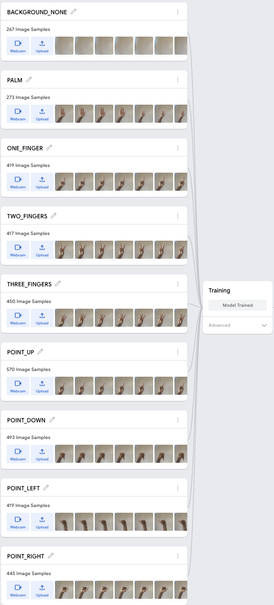 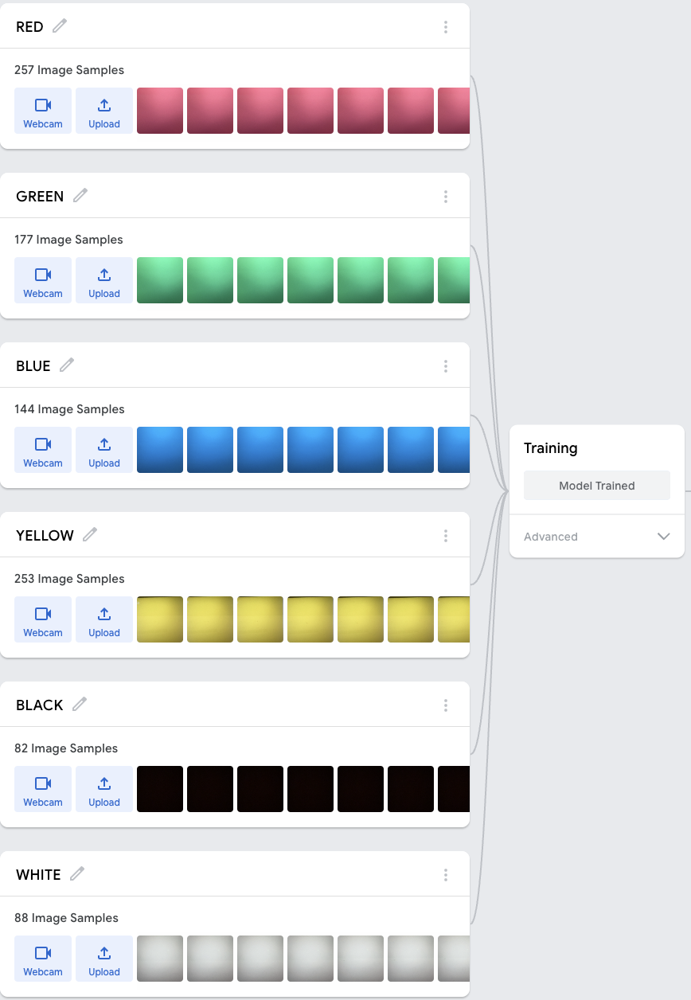

---

**Testing Results:**

**Browser Preview (Training Environment):** 
- 95-100% confidence across all classes
- Minor expected fluctuation between similar classes
- Fast, responsive predictions

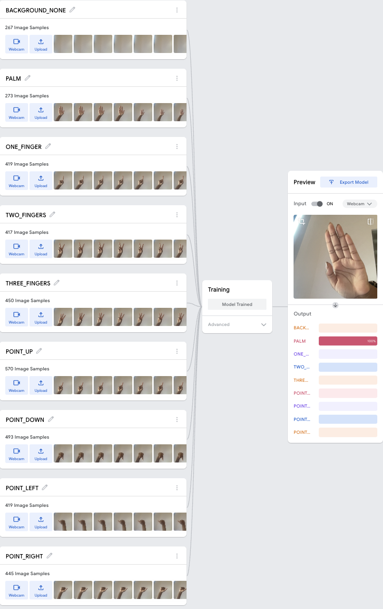 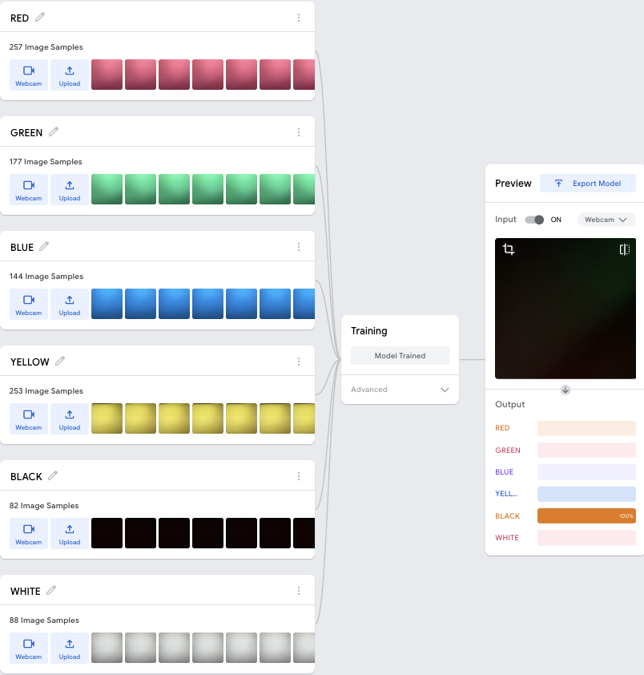

**Raspberry Pi Deployment:** 

*Color Model Issues:*
- Heavy bias toward RED/YELLOW (black misclassified 70% of time)
- Only partial success with blue

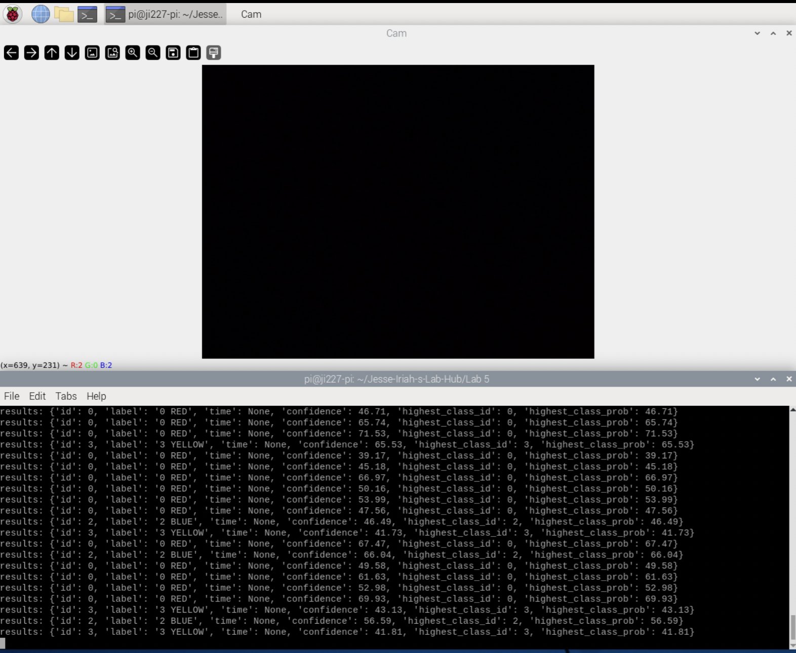 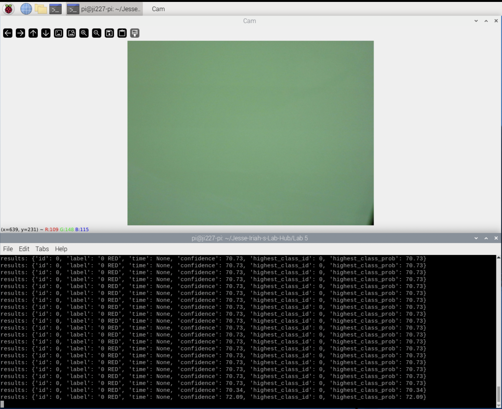

*Gesture Model Issues:*
- Only PALM (99%), BACKGROUND (100%), THREE_FINGERS (99%) reliable
- All pointing directions and 1-2 finger counting failed

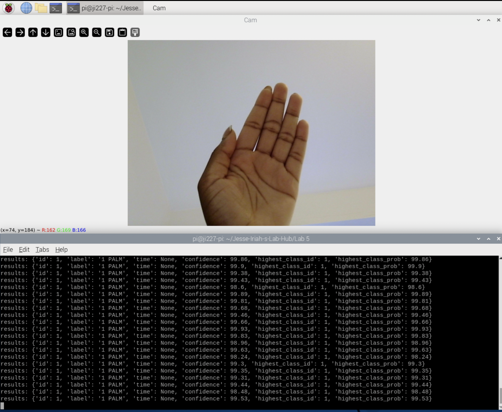 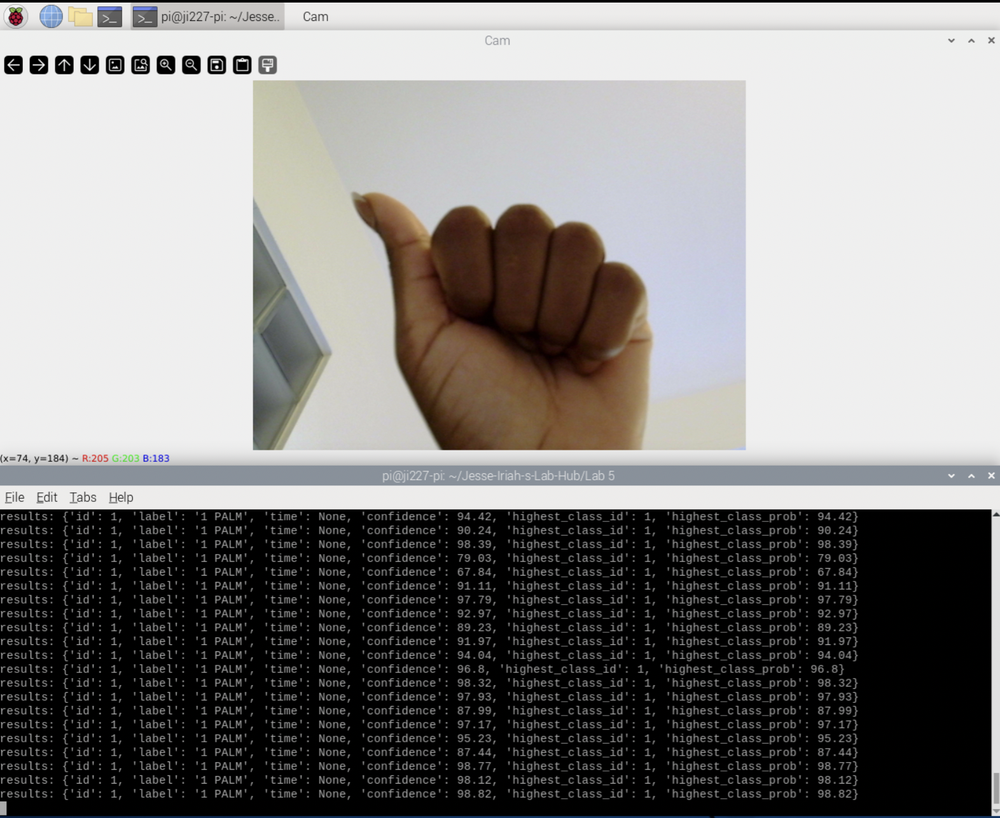

---

**Comparison:**

| Model | FPS | Deployment | Performance |
|-------|-----|------------|-------------|
| PyTorch | ~13 | Direct frames | Good (60-99%) |
| MediaPipe | 8-11 | Direct frames | Good |
| Teachable Machines | ~10 | Frame save/load | Poor (bias issues) |

------

**Analysis:**

The models performed well in browser preview (95-100% confidence) but failed significantly on Pi deployment despite identical camera, lighting, and location. The issue stems from different inference pipelines:
```
Browser:  Live webcam → Inference
Pi:       Webcam → Save JPEG → Load → Inference
```

The intermediate save/load step likely introduced jpeg compression artifacts and color space conversion issues.

**Teachable Machines Trade-offs:**
- **Strengths:** Fast training (< 5 min), no coding required, visual interface, multiple export formats. This makes it suitable for rapid prototyping, browser apps, education etc.
- **Weaknesses:** Black-box pipeline (hard to debug), environment-dependent, poor edge device deployment. This makes it a poor choice for when training is not the deployment environment

---

**Code & Models:**
- Deployment scripts: [`tml_gestures.py`](Deliverables/teachableMachines/tml_gestures.py), [`tml_colors.py`](Deliverables/teachableMachines/tml_colors.py)
- Gesture model: [`gestures_model.tflite`](Deliverables/teachableMachines/gestures_model/gestures_model.tflite), [`gestures_labels.txt`](Deliverables/teachableMachines/gestures_model/gestures_labels.txt)
- Color model: [`colors_model.tflite`](Deliverables/teachableMachines/colors_model/colors_model.tflite), [`colors_labels.txt`](Deliverables/teachableMachines/colors_model/colors_labels.txt)


---

## Part 1B. Prototyping an Interaction

### Thumbs Feedback System

**Selected Model:** MediaPipe Hand Pose Tracking

**Why MediaPipe?**
- Proven reliability on the Pi (8-11 FPS, good tracking accuracy from Part A testing)
- Real-time landmark detection enables gesture recognition
- Stronger than Teachable Machines (which had deployment pipeline issues)
- PyTorch limited to pre-trained object classes, couldn't detect custom gestures

**System Overview:**

The Thumbs Feedback System provides instant visual feedback for thumbs up/down gestures using the Adafruit Mini PiTFT display. The system combines MediaPipe's hand landmark detection with custom gesture recognition logic to create an intuitive approval/disapproval interface.

**Interaction Flow:**
```
User performs gesture → MediaPipe detects hand landmarks → 
Analyze thumb orientation & finger positions → Update PiTFT display
```

**Hardware Components:**
- Raspberry Pi 4
- USB Webcam
- Adafruit Mini PiTFT (240x135, ST7789)

**Gesture Detection Logic:**

The system analyzes MediaPipe's 21 hand landmarks to detect:
1. **Thumbs Up (👍):**
   - Thumb tip (landmark 4) is above thumb base (landmark 2) by >30 pixels
   - Other fingers are closed (fingertips below knuckles)
   - **Output:** Green background + yellow smiley face + "Thumbs Up!" text

2. **Thumbs Down (👎):**
   - Thumb tip is below thumb base by >30 pixels
   - Other fingers are closed
   - **Output:** Red background + yellow frowny face + "Thumbs Down!" text

3. **Neutral/No gesture:**
   - Hand not detected or invalid pose
   - **Output:** Black background + "Waiting..." text

**Visual Feedback Design:**

The PiTFT displays were designed for clear, immediate recognition:
- **Color coding:** Green = positive, Red = negative, Black = neutral
- **Facial expressions:** Programmatically drawn smiley/frowny faces using PIL shapes
  - Face: Yellow circle (ellipse)
  - Eyes: Black circles
  - Smile/Frown: Arc shapes
- **Text:** Centered on the display

**Demo Video:**

[](https://drive.google.com/file/d/1wJ8BpLzLEhQJ1r9ytbh5xP_ICsSO2oqt/view?usp=sharing)

**Code:** [`thumbs_feedback.py`](Deliverables/thumbs_feedback.py)

**Key Features:**
- Real-time gesture recognition (8-11 FPS)
- Immediate visual feedback on PiTFT
- Debug camera window shows hand landmarks and detection status
- Simple, intuitive interaction requiring only thumb gestures

**Design Considerations:**
- 30-pixel threshold provides good balance between sensitivity and stability
- Separate detection logic for each finger ensures strong gesture classification
- Visual feedback placed on PiTFT for standalone operation

---

## Part 1C. Testing & Evaluation

### Testing Summary

The Thumbs Feedback System was tested across multiple scenarios to identify success cases, failure modes, and limitations. Testing revealed strong performance under optimal conditions but also uncovered specific environmental and usage constraints.

**Success Cases - When It Works:**

The system performs reliably when:
- **Good lighting conditions** - Ambient room lighting or even directional spotlight (tested with flashlight behind camera)
- **Proper distance** - 1-3 feet from camera; system is stable even at extended distances
- **Steady hand position** - Gesture held for 1-2 seconds allows camera to focus and system to stabilize
- **Clear hand visibility** - Full hand in frame with all fingers visible
- **Single user or synchronized users** - One person, or multiple people making the same gesture

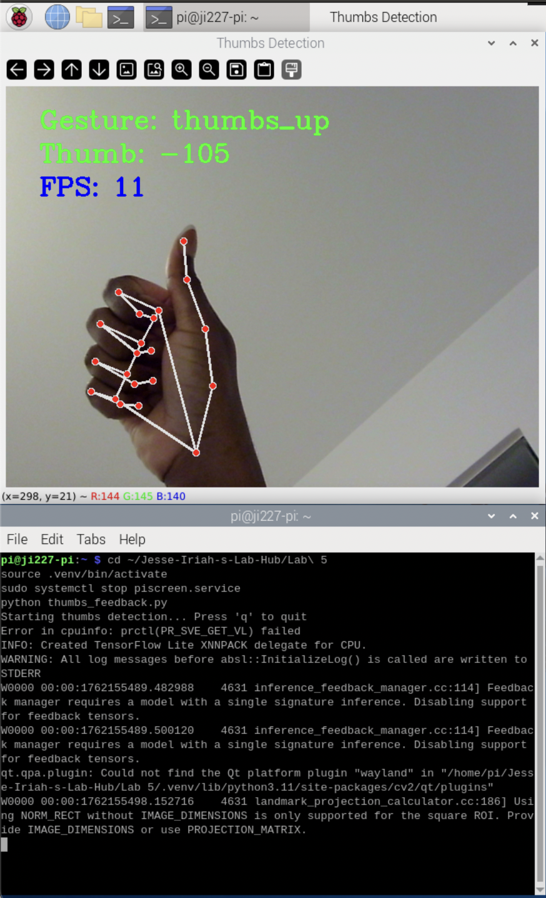
*Optimal performance: centered hand, good lighting, proper distance - consistent 10-11 FPS detection*

**Failure Cases - When It Breaks:**

| Scenario | Observed Behavior | Root Cause | Media |
|----------|------------------|------------|-------|
| **Too Close (<1 ft)** | No detection, black screen persists | Hand fills frame - MediaPipe cannot identify all 21 landmarks | 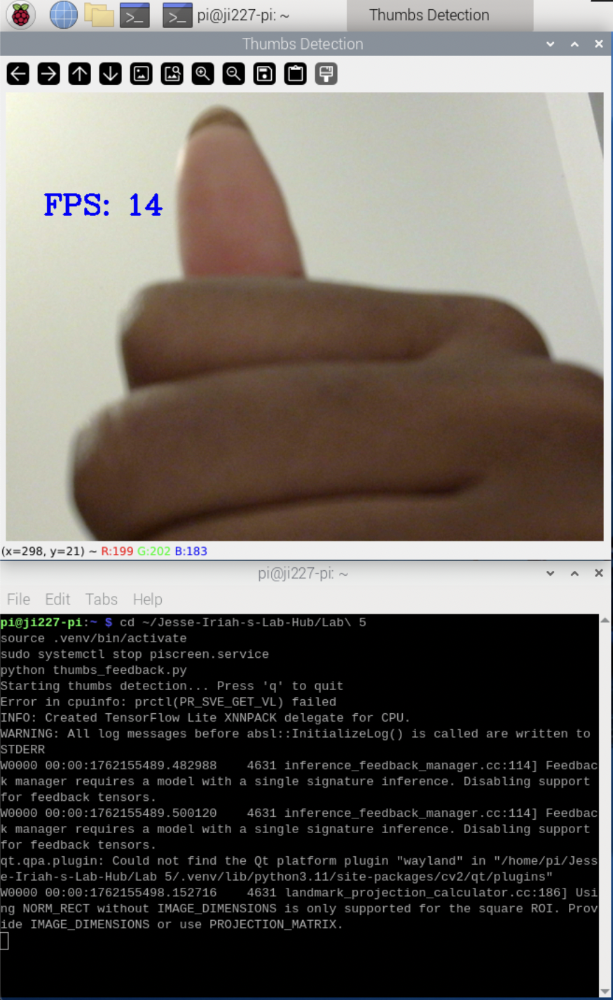 |
| **Complete Darkness** | No detection, system shows only FPS counter | Camera unable to capture usable image data | 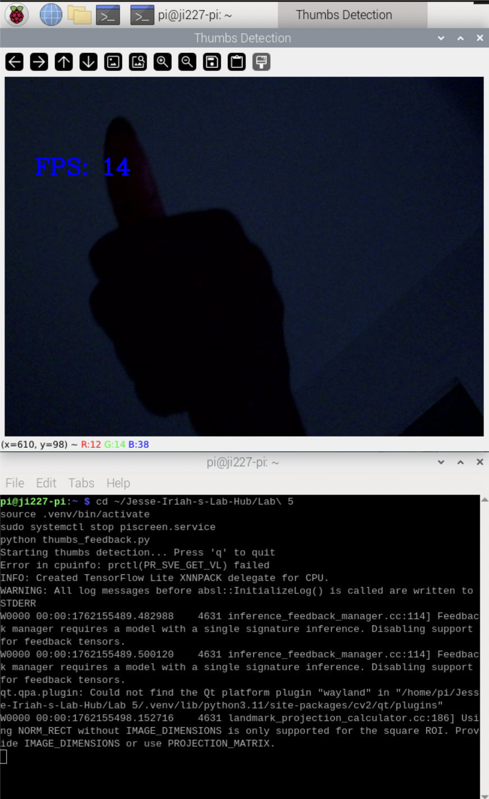 |
| **Incorrect Gestures** (open palm, pointing finger) | Neutral state maintained | Closed-fist requirement not met - fingers extended don't satisfy gesture logic | 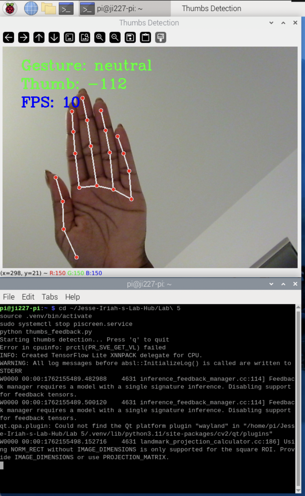 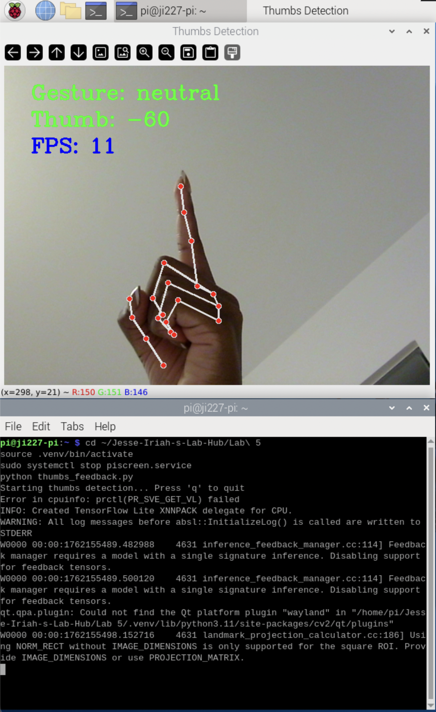 |
| **Two Opposite Gestures (Thumbs Up/Thumbs Down)** | Rapid flickering between thumbs_down and neutral states | System processes hands sequentially; conflicting inputs create state oscillation | [Video](Deliverables/testingCharacterization/case_2handsOpposite.mp4) |
| **Fast Movement** | 1-2 second delay before detection | Camera autofocus lag + frame processing latency compounds | [Video](Deliverables/testingCharacterization/case_tooFast.mp4) |

**Edge Cases:**

1. **Side Angle (45° rotation):** 
   - **Result:** Still detected correctly
   - **Why:** Landmark-based detection is rotation-invariant; thumb tip vs. base calculation works at angles
   - 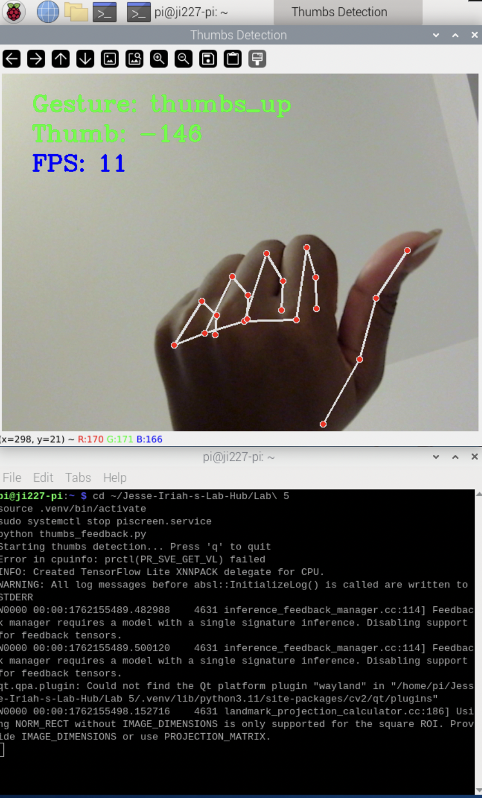
2. **Extended Distance:**
   - **Result:** Works well beyond 3 feet
   - **Why:** MediaPipe can still resolve landmarks as long as hand is sufficiently large in frame
   - 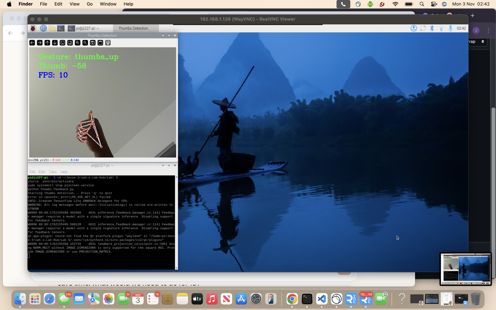
3. **Spotlight (darkness with directional light):**
   - **Result:** Performs as well as ambient lighting
   - **Why:** System only needs sufficient illumination on hand, not ambient room lighting
   - 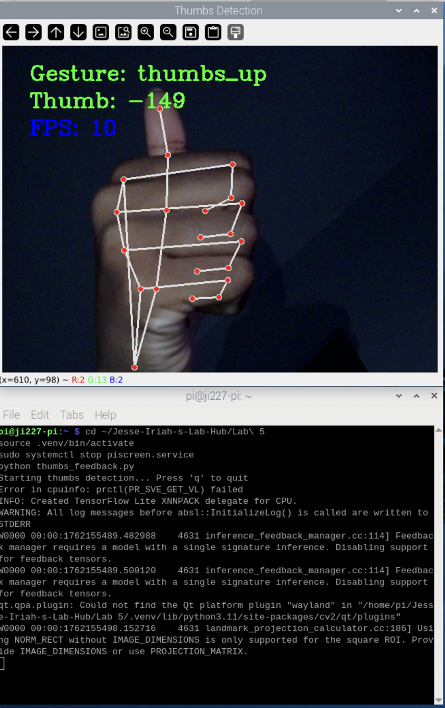
4. **Two Identical Hands:**
   - **Result:** Both tracked, correct gesture displayed
   - **Why:** MediaPipe multi-hand detection; both hands satisfy same gesture condition
   - 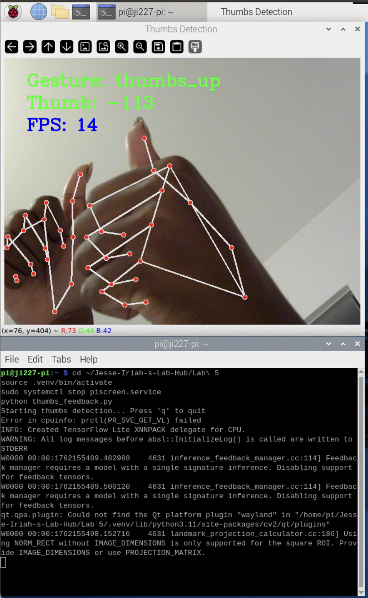

### Why It Fails

**Root causes of failure modes:**

1. **MediaPipe Landmark Detection Limits:**
   - Requires all 21 hand points visible
   - Fails when hand too close (out of bounds) or too dark (insufficient contrast)
2. **Camera Hardware Constraints:**
   - Autofocus introduces 1-2s latency for fast movements
   - Low-light sensitivity limited; cannot capture frames in complete darkness
3. **Gesture Logic Design:**
   - Closed-fist requirement intentionally rejects open-hand gestures (feature, not bug)
   - Sequential hand processing creates state conflicts with opposing gestures
4. **Frame Rate Bottleneck:**
   - 8-11 FPS processing creates inherent lag
   - Not fast enough for rapid gesture transitions

### Based on observed behavior, what other scenarios could cause problems?

1. **Gloves or hand coverings** - May obscure landmarks or alter hand appearance
2. **Skin tone variation in extreme lighting** - Very dark or very light skin against similar-colored backgrounds
3. **Partial hand obstruction** (e.g., holding object) - Would fail landmark detection
4. **Multiple users taking turns quickly** - State would oscillate as hands enter/exit frame
5. **Shaky camera/moving Pi** - Motion blur could degrade landmark detection accuracy
6. **Background with hand-like shapes** - Unlikely but could cause false detections

### Design Improvements

**Optimizations Implemented During Development:**

1. **Closed-fist requirement**   
   - Checks each finger individually (tips below knuckles)
   - Drastically reduced false positives from open hands
2. **30-pixel threshold for thumb orientation**  
   - Prevents micro-movements from triggering state changes
   - Balances sensitivity vs. stability
3. **Visual feedback on both screens**  
   - PiTFT shows user-facing output (green/red/black + faces)
   - Debug window shows landmarks and detection status for troubleshooting
4. **Neutral state as default**  
   - System shows "Waiting..." when uncertain
   - Prevents random triggering when no hand present

**Potential Future Improvements:**

1. State persistence/smoothing: Hold detected state for 0.5s before allowing change to eliminate flickering with conflicting hands
2. Confidence threshold: Only trigger state change above 80% gesture confidence. Add "unsure" state for ambiguous poses
3. Distance/lighting warnings: Display "Move closer" or "Need more light" messages to help users self-correct rather than confusion at black screen
4. Show "No hand detected" vs "Gesture unclear" distinct messages
5. Show a count for the number of hands detected if in polling mode
6. Multi-hand priority logic: Detect which hand appeared first and prioritize it or ignore secondary conflicting hands if the device is not in polling mode.
7. Adaptive exposure: Programmatically adjust camera brightness for low-light environments
8. Gesture timeout: Auto-reset to neutral if same gesture held >10 seconds. This could prevent "stuck" states
9. Display detection confidence percentage

### Impact of Misclassification

| Error Type | Frequency | Impact | User Response |
|------------|-----------|--------|---------------|
| **False Negative** (gesture not detected) | Moderate (in suboptimal lighting) | Low - User simply repeats gesture | Minor inconvenience |
| **False Positive** (wrong gesture detected) | Very rare (closed-fist requirement effective) | Low - Immediate PiTFT feedback alerts user | Quick correction |
| **State Flickering** (rapid changes) | Rare (only with conflicting hands) | Medium | Remove secondary hand |
| **Complete Failure** (no detection) | Rare (only in darkness or extreme close-up) | Medium - No feedback confuses users | Adjust distance/lighting |

**How Design Mitigates Errors:**

1. **Immediate Visual Feedback:**
   - PiTFT displays current state in <0.1s
   - Users instantly know if their gesture was detected correctly
   - Enables rapid self-correction
2. **Simple Gesture Vocabulary:**
   - Only 2 gestures (thumbs up/down) reduces confusion
   - Universally understood gestures require no training
3. **Detection Logic:**
   - Closed-fist requirement errs on side of false negatives
   - Prevents unintended triggers more important than catching every gesture
4. **Debug Window (Optional):**
   - Shows hand landmarks and thumb orientation value
   - Helps developers troubleshoot, not needed for end users
5. **Low Consequence Domain:**
   - Feedback/polling use case means errors are not safety-critical
   - Users can always repeat input without harm


**User Awareness of Uncertainties:**

Currently, users are not explicitly informed of system limitations:
- No error messages for darkness or distance failures
- No visual indicators of detection confidence
- Neutral state looks the same for "no hand" , "ambiguous gesture" etc

---

## Part 1D. System Characterization

### What can you use this system for?

**Primary Applications:**
- **Audience feedback/polling** - Quick approve/disapprove during presentations
- **Accessibility control** - Hands-free yes/no input for users with limited mobility
- **Review/rating systems** - Binary approval for content, products, decisions
- **Classroom engagement** - Students signal understanding (thumbs up) or confusion (thumbs down)
- **Remote participation** - Silent feedback in video calls without unmuting

**Potential Extensions:**
- Count thumbs up/down to tally group opinions
- Log feedback with timestamps for analytics
- Trigger other actions (send notification, record vote, control device)

### What is a good environment for this system?

**Optimal Conditions:**
- **Lighting:** Indoor ambient lighting or directional spotlight (spotlight test showed this works well)
- **Distance:** 1-3 feet from camera (tested - too far still works, too close fails)
- **Background:** Any background - MediaPipe focuses on hand regardless
- **Usage:** Single user at a time, or multiple users with identical gestures
- **Setting:** Controlled indoor environment (classroom, meeting room, home office)

### What is a bad environment for this system?

**Challenging Conditions:**
- **Complete darkness** - Camera cannot capture image (blackout test failed)
- **Extreme close-up** - Hand fills entire frame, mapping not possible
- **Multiple conflicting users** - Two people with opposite gestures causes flickering
- **Fast-paced interactions** - 1-2 second lag from camera focus makes rapid gestures impractical
- **Variable lighting** - Sudden brightness changes (outdoor sun, moving shadows) may affect camera exposure

### When will this system break?

**Hard Failures** (No detection):
1. **Insufficient light** - Below camera's minimum sensitivity
2. **Occluded hand** - Fingers not visible or hand partially out of frame
3. **No closed fist** - Open palm or extended fingers don't trigger detection
4. **Extreme distance** - Hand too small for landmark detection (>6 feet)

**Soft Failures** (Degraded performance):
1. **Multiple hands with opposite gestures** - Display flickers between states
2. **Camera focus lag** - Fast movements take 1-2 seconds to register
3. **Side angles >60°** - May lose thumb orientation accuracy
4. **Similar gestures** - Peace sign or pointing up register as neutral (acceptable)

### How does the system feel?

**User Experience (with Iqra and Kyle) :**
*Responsiveness:* Moderate lag (8-11 FPS detection + 1-2s camera focus) makes it feel deliberate rather than instant. Users must hold gestures for 1-2 seconds for reliable detection.  
*Satisfaction:* High - immediate visual feedback on PiTFT is rewarding. Clear color changes (green/red) and facial expressions make success obvious.  
*Intuitiveness:* Thumbs up/down is universally understood. No learning curve.  
*Reliability:* Good in optimal conditions, but users quickly learn to hold steady and ensure good lighting. The closed-fist requirement prevents most false positives.  
  
*Frustration Points:* 
- Flickering with multiple users (confusing which input counts)
- Camera focus lag makes rapid interactions not practical

**Overall Review:** The system feels like a thoughtful polling tool. It is best suited for deliberate, intentional feedback rather than quick, spontaneous gestures.

### Characterization Media

**All testing scenarios:** [`testingCharacterization/`](Deliverables/testingCharacterization/)

| Test Case | Result | Media |
|-----------|--------|-------|
| Default (Optimal) | Success |  |
| Too Close | No detection |  |
| Too Far | Still works |  |
| Side Angle (45°) | Detected |  |
| Complete Darkness | No detection |  |
| Spotlight Only | Works well |  |
| Wrong Gesture (Palm) | Neutral |  |
| Wrong Gesture (Point) | Neutral |  |
| Two Identical Hands | Both tracked |  |
| Two Opposite Hands | Flickering | [Video](https://github.com/user-attachments/assets/cba113c1-4ea0-499e-8d15-83a22e749d3a) |
| Fast Movement | 1-2s lag | [Video](https://github.com/user-attachments/assets/d328e8b4-07b3-4f15-bd50-22cc19f560cf) |

---


- **Characterization Media:**  
  [](link-to-video)

---

## Part 2. Final System & Demonstration

### Evolution from Prototype to Final System

The initial prototype (Part 1B) demonstrated basic thumbs up/down detection with simple visual feedback. For the final system, this was evolved into a practical vote counting application with significant improvements based on testing insights from Parts 1C and 1D.

**Key Improvements Implemented:**

1. **Vote Counting State Machine**
   - Problem: Original system displayed current gesture only, with no memory
   - Solution: Implemented state machine that counts votes and prevents double-counting
   - Logic: `neutral → gesture detected → hold 0.5s → count vote → must return to neutral`
2. **State Persistence** 
   - Problem: Rapid flickering when hand moved or multiple conflicting hands present
   - Solution: 0.5-second hold requirement before vote registers
   - Impact: Eliminates accidental votes from hand movements
3. **Enhanced User Feedback**
   - Problem: System could not distinguish between "no hand detected" vs "waiting for gesture"
   - Solution: Distinct messages for different states ("Ready", "Voting Up...", "Vote Counted!", "No hand")
   - Added: Progress indicator showing hold percentage (0-100%)
4. **Hand Count Display**
   - Problem: System unclear about multi-hand detection capability
   - Solution: "# of Hands Detected: X" shown on debug window
   - Note: System prioritizes first detected hand for vote counting
5. **Vote Statistics**
   - Added: Running totals for thumbs up/down
   - Added: Net sentiment score (Up - Down)
   - Added: Total votes cast
   - Added: Reset functionality (press 'R' key)
6. **Visual Design Improvements**
   - Problem: Emoji font not available, text overflow on 240x135 display
   - Solution: Custom-drawn triangle arrows (up/down) using PIL polygon drawing
   - Solution: Optimized font sizes and layout for small screen
   - Result: Clean, readable display that fits within constraints

### System Architecture (Comaprison)

| Version | Purpose | Key Features |
|---------|---------|--------------|
| **v1: Thumbs Feedback** | Real-time gesture feedback | Instant visual response, smiley/frowny faces, simple interaction |
| **v2: Thumb Counter** | Vote counting/polling | State machine, vote tallying, statistics, reset capability |

#### v1 Architecture (Thumbs Feedback System)

The original system operates as a real-time gesture recognition pipeline. Camera input (640x480) feeds into MediaPipe, which tracks 21 hand landmarks. The gesture classifier analyzes thumb tip position relative to thumb base (30-pixel Y-axis threshold) and verifies closed-fist configuration, outputting thumbs_up, thumbs_down, or neutral states. These states directly drive PiTFT display output with color-coded backgrounds (green/red/black) and programmatically-drawn facial expressions. The pipeline operates at 8-11 FPS with minimal latency.

**v1 State Machine:**
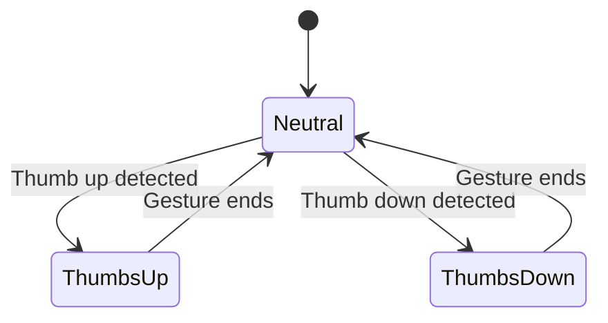
```mermaid
stateDiagram-v2
    [*] --> Neutral
    
    Neutral --> ThumbsUp: Thumb up detected
    Neutral --> ThumbsDown: Thumb down detected
    
    ThumbsUp --> Neutral: Gesture ends
    ThumbsDown --> Neutral: Gesture ends
```

#### v2 Architecture (Thumb Counter System)
The enhanced vote counting system extends v1 by adding a persistent state machine and vote tallying mechanism. While the detection pipeline remains identical (camera → MediaPipe → gesture classification), classified gestures now feed into a state management layer rather than directly controlling display output. 

The state machine implements a four-state model (neutral, counting, counted_up, counted_down) with temporal requirements. When a thumbs_up or thumbs_down gesture is detected in neutral state, a timer initializes requiring 0.5 seconds of continuous hold before the vote registers. Once this threshold is met, the appropriate counter increments and the state transitions to counted_up or counted_down. The system remains in this counted state until the hand returns to neutral or leaves the frame, preventing double-counting while allowing rapid sequential voting. The display layer renders custom arrow icons alongside vote counts, total votes, and net sentiment score, with all data persisting in memory until manual reset.

For multi-hand scenarios, `detector.findPosition(img, handNo=0)` returns only the first detected hand (ordered by MediaPipe confidence), preventing double-voting while simplifying conflict resolution.

**v2 State Machine:**
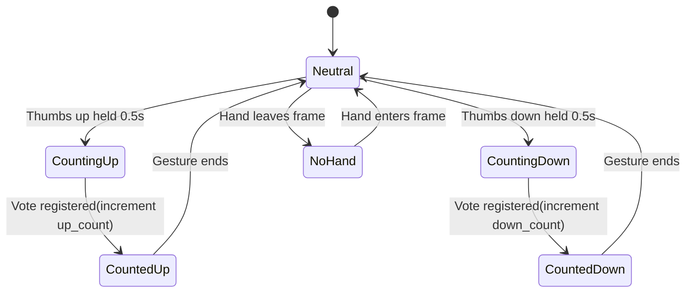
```mermaid
stateDiagram-v2
    [*] --> Neutral
    Neutral --> CountingUp: Thumbs up held 0.5s
    Neutral --> CountingDown: Thumbs down held 0.5s
    CountingUp --> CountedUp: Vote registered(increment up_count)
    CountingDown --> CountedDown: Vote registered(increment down_count)
    CountedUp --> Neutral: Gesture ends
    CountedDown --> Neutral: Gesture ends
    Neutral --> NoHand: Hand leaves frame
    NoHand --> Neutral: Hand enters frame
```

### Code Structure
*Core Components:*
1. **`detect_thumbs_orientation(lmList)`** - Gesture detection logic that analyzes landmark positions and returns classification: "thumbs_up", "thumbs_down", "neutral", or "no_hand"
2. **`update_display(gesture, up_count, down_count)`** - PiTFT rendering function that draws custom arrow icons, displays vote statistics, and provides color-coded feedback
3. **State Machine Loop** - Vote counting logic implementing temporal requirements and state transitions for vote registration
4. **`draw_up_arrow()` / `draw_down_arrow()`** - Custom icon rendering functions that draw triangle polygons to replace emoji dependencies

### Final Demo Video

[

*Video demonstrates: Real-time vote counting with dual displays (PiTFT + debug window), thumbs up/down vote registration, state machine requiring neutral return between votes, calculations, multi-hand detection behavior and hold progress indicator.*

### Performance Metrics

| Metric | Value | Notes |
|--------|-------|-------|
| **FPS** | 8-11 | Consistent with Part 1A MediaPipe testing |
| **Vote Registration Time** | 0.5s | Hold time before count increments |
| **State Transition** | <0.1s | Display updates immediately after vote |
| **Detection Range** | 1-4 feet | Works beyond expected range from Part 1C testing |
| **Hand Count Accuracy** | 100% | MediaPipe reliably counts 1-2 hands |
| **Gesture Classification** | ~95% | Occasional neutral misclassification in edge cases |

### Future Improvements

- Complete darkness failure - Could add brightness warning
- Fast movement lag - Camera hardware limitation
- No confidence display - Could show detection confidence percentage

### Use Cases

The final Thumb Counter system is well-suited for small group polls (2-10 people), classroom engagement checks, workshop feedback, accessibility voting (hands-free yes/no), and party games. The system is not suitable for large scale elections (no voter identification), high-speed voting (0.5s hold time required), outdoor use (lighting sensitivity), or privacy-critical votes (camera records all voters).

### Code 

- **Initial prototype:** [`thumbs_feedback_v1.py`](Deliverables/thumbs_feedback_v1.py)
- **Final system:** [`thumb_counter_v2.py`](Deliverables/thumb_counter_v2.py)
- **Supporting files:** [`HandTrackingModule.py`](HandTrackingModule.py)


---

## Sources & References

- MediaPipe Python API  
- PyTorch MobileNet  
- Teachable Machines  
- [Bellotti et al.](link-to-paper-if-applicable)  

---
