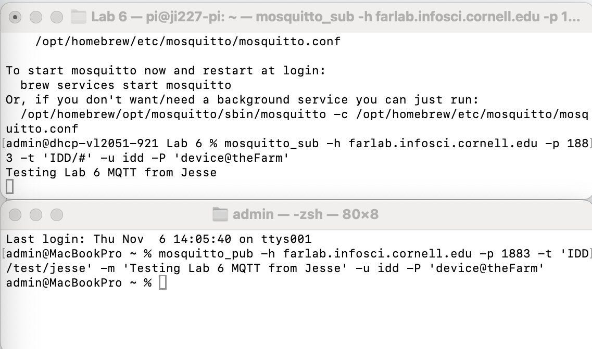
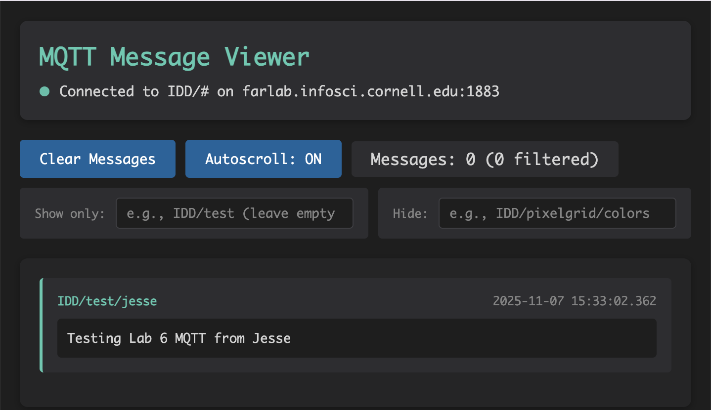
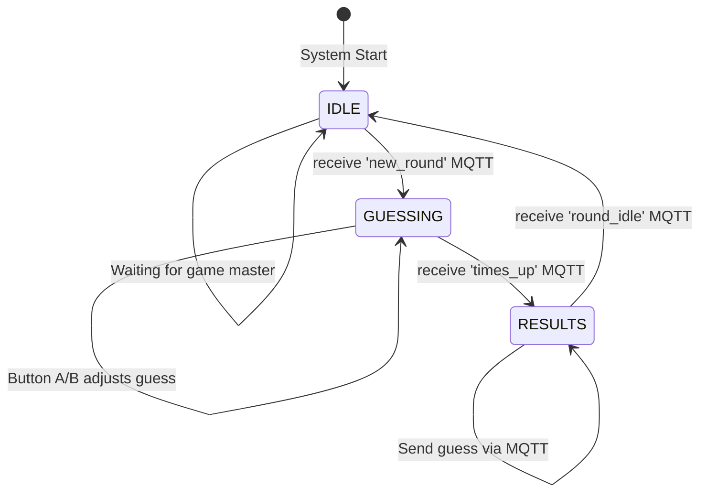

# Distributed Interaction

**Collaborators:**  
Angela Bi, Kyle Li, Nophar Shalom, Jesse Iriah

---

## Project Overview

The distributed guessing game enables multiple players to use Raspberry Pis to guess the number of birds shown on a central display. Each Pi acts as an individual player controller with physical buttons for input and an LCD display for game state feedback. Players compete in timed rounds to see who can guess closest to the correct answer, with all devices communicating through MQTT messaging to maintain synchronized game state.  

---
# Part A: MQTT Messaging Setup

### MQTT Installation & Configuration

- **Installation Commands:**
  - **On Raspberry Pi:**
```bash
    sudo apt-get update
    sudo apt-get install -y mosquitto-clients
```
  - **On macOS:**
```bash
    brew install mosquitto
```
- **Broker Configuration:** `farlab.infosci.cornell.edu:1883`
- **Authentication:** User: `idd`, Password: `device@theFarm`

### MQTT Testing

- **Subscribe Test:**
```bash
  mosquitto_sub -h farlab.infosci.cornell.edu -p 1883 -t 'IDD/#' -u idd -P 'device@theFarm'
```
  Successfully subscribed to all IDD topics and received published messages.

- **Publish Test:**
```bash
  mosquitto_pub -h farlab.infosci.cornell.edu -p 1883 -t 'IDD/test/jesse' -m 'Testing Lab 6 MQTT from Jesse' -u idd -P 'device@theFarm'
```
  
  *Screenshot showing successful message publication and reception between terminals*

- **Debug Tool Results:**
  
  *Web-based MQTT viewer at http://farlab.infosci.cornell.edu:5001 showing birdgame messages with MAC addresses and guess values*


### Brainstormed Ideas

1. **Number Guessing Game** - Multiple players guess a number/quantity shown on screen
2. **Music Maker** - Each Pi controls one instrument/sound parameter
3. **Colour Guessig Game** - Multiple players try to guess/replicate a colour using input RGB/hex 
4. **Mood Ring** - Combined sensor inputs create collective mood visualization
5. **Distributed Storytelling** - Each Pi adds elements to a collaborative narrative


---

# Part B: Collaborative Pixel Grid

### Hardware Setup

- **Sensor Configuration:** APDS-9960 RGB sensor connected via Qwiic connector
- **Wiring Documentation:** Single Qwiic cable connection to Pi's I2C port
- **Pi Setup:** [Photo: Deliverables/pi_with_sensor.jpg]

### Software Configuration

- **Server Setup:** [Documentation of server running on laptop]
 ```bash
 cd "Lab 6"
 source .venv/bin/activate
 python app.py
 ```
- **Pi Publisher Script:** [Running pixel_grid_publisher.py]
 ```bash
 python pixel_grid_publisher.py
 ```

- **Virtual Environment:** Created/ activated with `python -m venv .venv` 


### Grid Testing

- **Grid Display:** [Screenshot of http://farlab.infosci.cornell.edu:5000]
- **Controller Interface:** [Screenshot of controller page]
- **Multi-Device Grid:** Successfully tested with 4 devices creating different colored pixels
- **Sensor Interaction:** Color detection worked by holding colored objects near APDS-9960


---

# Part C: Distributed System - Bird Guessing Game

## System Design

### Initial Concept Sketches & Storyboard

[Image: Deliverables/concept_storyboard.png]

**Scene 1:** Players gather with Pis, server displays "Waiting for players..."
**Scene 2:** Game master starts round, bird image appears on central screen
**Scene 3:** Players use buttons to adjust guess, seeing number on Pi display
**Scene 4:** Timer expires, all guesses submitted automatically via MQTT
**Scene 5:** Results shown - winner highlighted, actual count revealed
**Scene 6:** Return to idle, ready for next round

### Concept Description

The Bird Guessing Game challenges players to estimate quantities shown on a central display within a time limit. Each player uses a Raspberry Pi as a personal controller with physical button inputs (increment/decrement) and receives real-time feedback on the device's display. The game creates engaging group dynamics through competitive timed rounds while demonstrating distributed system coordination through MQTT messaging.

### Architecture Diagram
```mermaid
graph TB
    subgraph "Central Server (Laptop)"
        S[Flask ServerGame Logic]
        W[Web InterfaceBird Display]
    end
    
    subgraph "Pi Client 1"
        P1[Python Client]
        B1[Buttons A/B]
        D1[LCD Display]
    end
    
    subgraph "Pi Client 2"
        P2[Python Client]
        B2[Buttons A/B]
        D2[LCD Display]
    end
    
    subgraph "Pi Client 3"
        P3[Python Client]
        B3[Buttons A/B]
        D3[LCD Display]
    end
    
    subgraph "MQTT Broker"
        M[farlab.infosci.cornell.edu:1883]
    end
    
    B1 -->|Input| P1
    B2 -->|Input| P2
    B3 -->|Input| P3
    
    P1 -->|Display| D1
    P2 -->|Display| D2
    P3 -->|Display| D3
    
    P1 |Pub/Sub| M
    P2 |Pub/Sub| M
    P3 |Pub/Sub| M
    S |Pub/Sub| M
    
    S -->|Updates| W
```

### State Diagram



### MQTT Topic Structure

- **Topics Used:**
  - `IDD/birdgame/client/register` - Pis register with MAC address
  - `IDD/birdgame/client/submit_guess` - Submit final guesses
  - `IDD/birdgame/broadcast/new_round` - Start new guessing round
  - `IDD/birdgame/broadcast/times_up` - End guessing period
  - `IDD/birdgame/broadcast/round_idle` - Return to idle state

- **Message Format:** 
```json
// Registration
{"mac": "2c:cf:67:df:5c:03"}

// Guess submission
{"mac": "2c:cf:67:df:5c:03", "guess": 34}
```

---

## Implementation

### Hardware Configuration

#### Device 1 (Pi #1) - Jesse
- **Hardware:** ST7789 Display, GPIO Buttons (pins 23, 24)
- **Setup Photo:** [Image: Deliverables/pi1_setup.jpg]
- **MQTT Role:** Publisher/Subscriber (Both)
- **Code Snippet:**
```python
def poll_buttons():
    if game_state == 'GUESSING':
        if not buttonA.value:  # Button A pressed
            current_guess += 1
            display_needs_update = True
        elif not buttonB.value:  # Button B pressed
            current_guess = max(0, current_guess - 1)
```

#### Device 2 (Pi #2) - Kyle
- **Hardware:** ST7789 Display, GPIO Buttons (pins 23, 24)
- **Setup Photo:** [Image: Deliverables/pi2_setup.jpg]
- **MQTT Role:** Publisher/Subscriber (Both)
- **MAC Address:** Unique identifier for player tracking

#### Device 3 (Pi #3) - Angela
- **Hardware:** ST7789 Display, GPIO Buttons (pins 23, 24)
- **Setup Photo:** [Image: Deliverables/pi3_setup.jpg]
- **MQTT Role:** Publisher/Subscriber (Both)

#### Device 4 (Pi #4) - Nophar
- **Hardware:** ST7789 Display, GPIO Buttons (pins 23, 24)
- **Setup Photo:** [Image: Deliverables/pi4_setup.jpg]
- **MQTT Role:** Publisher/Subscriber (Both)

### Server/Central Processing

- **Server Code:** [Link: Deliverables/game_server.py]
- **Data Aggregation:** Collects all player guesses via MQTT, compares to correct answer
- **Output Generation:** Determines winner based on closest guess, broadcasts results

---

## User Testing

### Test Session 1 - Iqra

- **Tester:** Iqra (not a team member)
- **Initial Expectations:** Expected a simple number entry game, surprised by competitive aspect
- **Testing Video:** [Link to Google Drive video]
- **Surprises:** 
  - Enjoyed the time pressure element
  - Found button controls intuitive
  - Liked seeing guess update in real-time
- **Suggested Changes:** 
  - Implement tie-breaking: "If there's a tie, the person who submitted first should win"
  - Add more visual feedback for winner announcement

### Test Session 2 - Akash  

- **Tester:** Akash (not a team member)
- **Initial Expectations:** Thought it would be turn-based, interested in simultaneous play
- **Testing Video:** [Link to Google Drive video]
- **Surprises:** 
  - Game's continuous looping nature
  - Simplicity of button controls
  - Quick round transitions
- **Suggested Changes:**
  - Add "best of 3" or tournament mode to have clear ending
  - Include player avatars/characters on screen for visual identification
  - Add sound effects for game events

### Key Findings

- Physical buttons provided satisfying tactile feedback compared to touchscreen
- Players wanted more visual representation of themselves in the game
- Competition element was engaging but needed clearer win conditions
- Time pressure created excitement but some wanted difficulty levels

---

## Project Reflection

### What Worked Well

- **MQTT Synchronization:** All devices stayed perfectly in sync throughout gameplay
- **Physical Controls:** Button input felt responsive and intuitive for quick adjustments
- **Display Feedback:** Real-time guess updates on Pi displays kept players engaged


### Challenges with Distributed Interaction

- **Challenge 1: Network Latency**
  - Description: Occasional delay between button press and server acknowledgment
  - Solution: Implemented local display updates before MQTT confirmation

- **Challenge 2: Player Identification**
  - Description: Difficult to track which guess belonged to which player
  - Solution: Used MAC addresses as unique identifiers, displayed last 5 chars

- **Challenge 3: State Synchronization**
  - Description: Ensuring all Pis transitioned states simultaneously
  - Solution: Server broadcasts state changes to all clients at once

### Sensor Event Handling

The button-based interaction proved very for this fast-paced game. The physical buttons eliminated false triggers and provided clear user intent. The 200ms debounce timer prevented double-inputs while maintaining responsiveness. State-based input validation (only accepting input during GUESSING state) prevented erroneous submissions.


### Potential Improvements

1. **Tournament Mode:** Implement Akash's suggestion for "best of 3" rounds with cumulative scoring
2. **Player Avatars:** Add visual representation of each player on the main display
3. **Progressive Difficulty:** Start with easier counts, increase complexity over rounds
4. **Timing Bonuses:** Reward faster correct guesses as suggested by Iqra
5. **Audio Feedback:** Add sound effects for round start/end and winner announcement

---

## Technical Documentation

### Dependencies

- **Server Requirements:** 
  - Flask, Flask-SocketIO, paho-mqtt
  
- **Pi Requirements:**
  - adafruit-circuitpython-rgb-display
  - paho-mqtt
  - Pillow (PIL)

### File Structure
```
Lab 6/
├── bird_game_client.py       # Pi client code with button input
├── game_server.py            # Central game server
├── templates/
│   ├── game_display.html     # Main game display interface
│   └── admin_control.html    # Game master controls
└── Deliverables/
    ├── mqtt_viewer_screenshot.png
    ├── concept_storyboard.png
    └── [test videos, photos]
```

### Debugging Process

- **MQTT Monitoring:** Used viewer at :5001 to track all game messages and verify MAC addresses
- **Command Line Testing:** 
```bash
  mosquitto_sub -h farlab.infosci.cornell.edu -p 1883 -t "IDD/birdgame/#" -u idd -P "device@theFarm"
```
- **Troubleshooting:** Initial button wiring issues resolved by checking pull-up resistor configuration

---

## Sources

- MQTT Protocol Documentation
- Paho Python MQTT Client Library
- Adafruit CircuitPython RGB Display Guide
- Flask-SocketIO Documentation for real-time web communication

---
